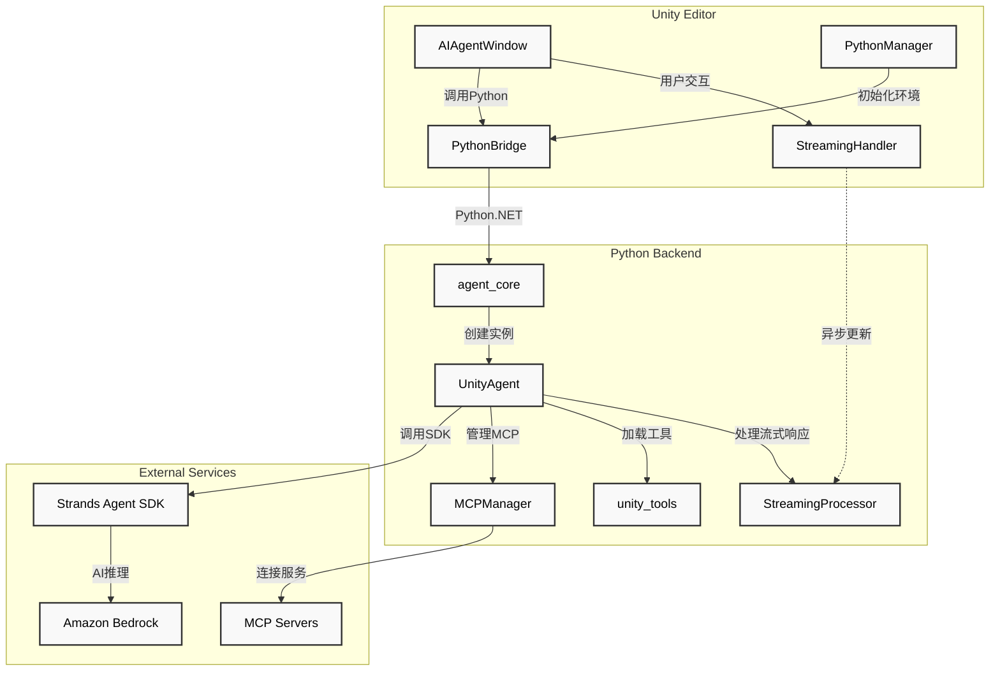
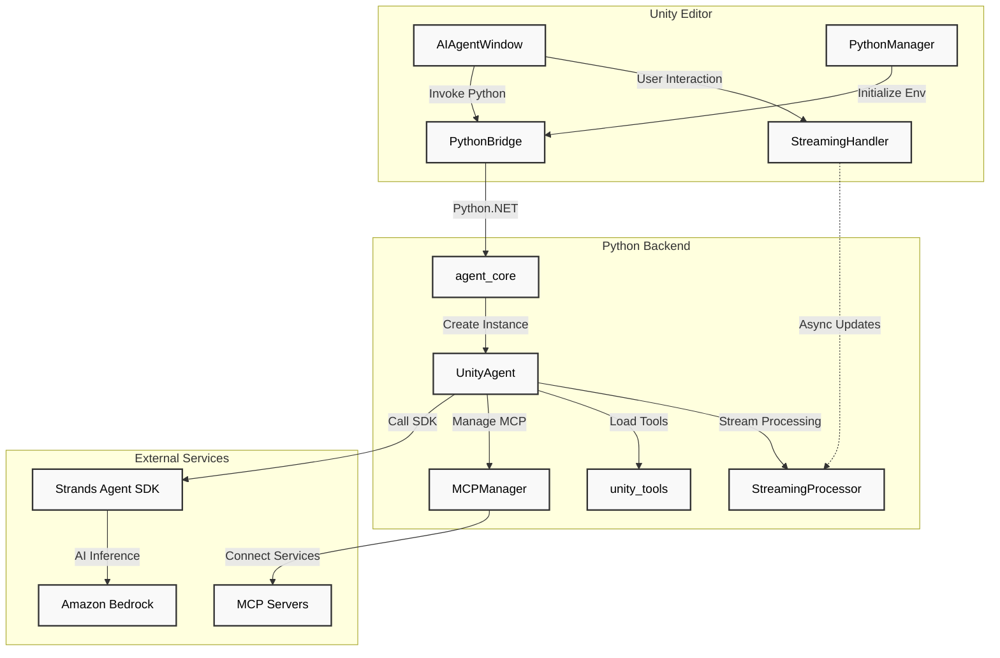

# Unity Strands Agent

**Language / 语言**: [中文](#中文版本) | [English](#english-version)

---

## 中文版本

Unity Strands Agent 是基于 AWS 开源 Strands Agent SDK 的 Unity 开发智能助手，为 Unity 开发者提供智能代码生成、项目优化建议和实时问答支持。


### 项目概述

Unity Strands Agent 将先进的 AI 能力直接集成到 Unity 编辑器中，通过深度理解 Unity 开发流程，为开发者提供智能化的开发辅助。该插件基于模块化架构设计，支持多种 AI 模型，并提供丰富的工具生态系统。

### 系统架构



### 主要特性

#### Unity 集成优势

##### 深度工作流整合

- **项目结构理解**: 智能识别 Unity 项目结构，提供针对性的代码生成和问题解决方案
- **组件管理**: 自动处理 GameObject 和组件依赖关系，确保代码符合 Unity 最佳实践
- **性能优化**: 基于 Unity 特定的性能瓶颈分析，提供针对性的优化建议

##### 工具生态系统

- **预构建工具**: 提供 21 个内置工具，涵盖文件操作、API 调用、数学计算、AI 服务、工作流管理等
- **MCP 协议支持**: 通过 Model Context Protocol 扩展第三方工具和服务集成能力
- **可选扩展**: 支持浏览器自动化、高级内存管理等可选功能模块

##### 企业级功能

- **AI 模型集成**: 当前支持 Amazon Bedrock，Strands Agent SDK 支持其他主流 AI 服务（Anthropic、OpenAI、Meta Llama 等）
- **上下文记忆**: 智能记住项目偏好和代码风格，提供个性化开发建议
- **团队协作**: 学习团队编码规范，自动调整代码以符合团队标准

### 快速开始

#### 系统要求

- **Unity**: 2022.3 LTS 或更高版本
- **操作系统**: macOS 10.15+ / Windows 10+ / Ubuntu 18.04+
- **Python**: 3.10 或更高版本（支持自动检测和配置）
- **Node.js**: 16.0 或更高版本（用于 MCP 工具支持）
- **AI 模型访问**: 需要配置 AWS CLI 凭证以使用 Amazon Bedrock 服务

#### 安装方法

##### 方法一：Git URL 安装（推荐）

**通过 Unity Package Manager**

1. 在 Unity 中打开 Package Manager
2. 点击 "Add package from git URL"
3. 输入：`https://github.com/ddpie/unity-strands-agent.git`
4. 等待 Unity 自动下载和导入

**通过 manifest.json**

在您的Unity项目中，打开 `Packages/manifest.json` 文件，在 `dependencies` 节点中添加：

```json
{
  "dependencies": {
    "com.ddpie.unity-strands-agent": "https://github.com/ddpie/unity-strands-agent.git#v1.0.0"
  }
}
```

**包安装**

保存 `manifest.json` 文件后，Unity将自动下载包。包中包含了所有必要的Python代码和依赖文件。

##### 方法二：本地开发安装

如果您正在开发或修改Unity AI Agent插件本身，可以使用本地文件引用：

```json
{
  "dependencies": {
    "com.ddpie.unity-strands-agent": "file:/path/to/unity-strands-agent"
  }
}
```

在这种模式下，不会自动部署Python代码，而是直接使用源项目中的文件。

#### 配置步骤

1. **打开设置窗口**
   - 在Unity中选择菜单：Window → Unity Strands Agent
   - 点击顶部的"Settings"标签页

2. **Python路径配置**
   - 点击"自动检测"按钮，系统会自动找到包中的Python代码路径
   - 或手动设置Strands工具路径

3. **AWS凭证配置**
   - AWS Access Key ID
   - AWS Secret Access Key  
   - AWS Region（默认为us-east-1）

4. **验证配置**
   - 点击"验证配置"按钮确保所有设置正确
   - 如果显示绿色勾号，说明配置成功

#### 更新插件

更新插件很简单，只需在 `manifest.json` 中更新版本标签：

```json
{
  "dependencies": {
    "com.ddpie.unity-strands-agent": "https://github.com/ddpie/unity-strands-agent.git#v1.1.0"
  }
}
```

Unity会自动下载新版本的包。

### 使用指南

#### 基本功能

1. **打开 Unity Strands Agent**: 在 Unity 中选择菜单 Window → Unity Strands Agent
2. **开始对话**: 在聊天界面输入问题或需求
3. **查看建议**: Unity Strands Agent 将提供代码生成、优化建议和问题解决方案

#### 高级功能

- **项目分析**: Unity Strands Agent 能够分析整个项目结构，理解组件关系
- **代码生成**: 根据需求生成符合项目风格的 C# 脚本
- **性能优化**: 提供针对性的性能优化建议
- **问题诊断**: 帮助诊断和解决常见的 Unity 开发问题

### 路径配置系统

#### 概述

路径配置系统提供统一的路径管理，将系统依赖路径提取到可配置界面中，方便用户根据不同环境进行调整。该功能已集成到 Unity Strands Agent 的设置界面中。

#### 主要功能

- **集成配置界面**: 路径配置集成在 Unity Strands Agent 设置界面中
- **简化配置**: 只需配置Python工具路径和AWS凭证
- **自动检测**: 自动检测Python工具路径
- **配置验证**: 实时验证配置的有效性

#### 使用方法

1. **打开配置界面**
   在 Unity Editor 中选择菜单：`Window > Unity Strands Agent`，切换到"设置"标签页，然后选择"路径配置"

2. **Python路径配置**
   - **项目根目录**: Unity 项目的根目录，自动检测
   - **Strands工具路径**: Unity AI 代理 Python 模块路径

3. **AWS凭证配置**
   - **AWS Access Key ID**: AWS访问密钥ID
   - **AWS Secret Access Key**: AWS访问密钥
   - **AWS Region**: AWS区域（默认为us-east-1）

4. **自动检测功能**
   - 点击"自动检测"按钮，系统会自动搜索和设置Python工具路径
   - 系统会自动在包目录中找到agent_core.py文件

#### 配置文件

配置保存在 `Assets/UnityAIAgent/PathConfiguration.asset` 文件中，会自动加载。

#### 环境变量

系统会自动设置以下环境变量供Python脚本使用：

**基本配置变量**
- `PROJECT_ROOT_PATH`：项目根目录路径
- `STRANDS_TOOLS_PATH`：Strands工具路径
- `AWS_ACCESS_KEY_ID`：AWS访问密钥ID
- `AWS_SECRET_ACCESS_KEY`：AWS访问密钥
- `AWS_DEFAULT_REGION`：AWS默认区域

### 路径说明

系统会自动检测并使用以下路径：

- `Library/PackageCache/com.ddpie.unity-strands-agent@xxx/Python/` - Python工具目录
- `Assets/UnityAIAgent/PathConfiguration.asset` - 配置文件

### 故障排除

#### 常见问题

1. **菜单项不显示**：
   - 检查Unity控制台是否有编译错误
   - 确认包已正确下载到Library/PackageCache目录
   - 重启Unity编辑器

2. **找不到agent_core模块**：
   - 点击"自动检测"按钮重新检测Python路径
   - 检查Library/PackageCache中是否有com.ddpie.unity-strands-agent包
   - 确认包中的Python目录包含agent_core.py文件

3. **AWS连接失败**：
   - 验证AWS Access Key和Secret Key是否正确
   - 确认AWS Region设置正确
   - 检查网络连接是否正常

#### 获取支持

如有问题，请：

1. 检查Unity控制台的错误日志
2. 在设置页面点击"验证配置"查看当前配置状态
3. 提交Issue到GitHub仓库并附上错误日志

### 开发和贡献

#### 项目结构

```text
unity-strands-agent/
├── Assets/                    # Unity 资源文件
│   └── UnityAIAgent/          # 运行时配置
│       ├── mcp_config.json    # MCP 协议配置
│       └── PathConfiguration.asset # 路径配置对象
├── Editor/                    # Unity Editor 扩展
│   ├── AIAgentWindow.cs       # 主界面和聊天功能
│   ├── SetupWizard.cs         # 设置向导
│   ├── PythonManager.cs       # Python 环境管理
│   ├── PathConfiguration.cs   # 路径配置系统
│   ├── PythonBridge.cs        # Unity-Python 桥接
│   ├── StreamingHandler.cs    # 流式响应处理
│   ├── MCPConfiguration.cs    # MCP 配置管理
│   ├── PathManager.cs         # 路径管理核心
│   ├── ThreadProtection.cs    # 线程安全工具
│   ├── LanguageManager.cs     # 国际化支持
│   └── UnityAIAgent.asmdef    # Unity 程序集定义
├── Python/                    # Python 后端
│   ├── streaming_processor.py # 实时 AI 响应处理
│   ├── unity_tools.py         # Unity 开发工具集
│   ├── mcp_manager.py         # MCP 服务器管理
│   ├── diagnostic_utils.py    # 系统诊断工具
│   ├── mcp_client.py          # MCP 客户端实现
│   ├── unity_agent.py         # Unity 专用 AI 代理
│   ├── unity_system_prompt.py # 系统提示词
│   ├── tool_tracker.py        # 工具使用跟踪
│   ├── ssl_config.py          # SSL 配置管理
│   ├── agent_core.py          # 核心 AI 代理功能
│   ├── unity_non_interactive_tools.py # 非交互工具
│   └── requirements.txt       # Python 依赖配置
├── package.json               # Unity Package Manager 配置
├── README.md                  # 双语项目文档
├── LICENSE                    # MIT 开源许可证
├── references.md              # 参考文档
└── requirement.md             # 技术需求说明
```

#### 贡献指南

1. Fork 项目
2. 创建功能分支 (`git checkout -b feature/AmazingFeature`)
3. 提交更改 (`git commit -m 'Add some AmazingFeature'`)
4. 推送到分支 (`git push origin feature/AmazingFeature`)
5. 打开 Pull Request

### 许可证

本项目基于开源社区开发，遵循相关开源许可证。具体许可证信息请查看 [LICENSE](LICENSE) 文件。

### 支持和反馈

- **文档**: [Strands Agent SDK 官方文档](https://strandsagents.com/latest/)
- **问题反馈**: [GitHub Issues](https://github.com/ddpie/unity-strands-agent/issues)

---

## English Version

Unity Strands Agent is a powerful AI-powered development assistant that brings the capabilities of AWS's open-source Strands Agent SDK directly into the Unity Editor. This plugin transforms your Unity development workflow by providing intelligent code generation, automated problem-solving, and context-aware development suggestions.


### Project Overview

Unity Strands Agent seamlessly integrates cutting-edge AI capabilities into your Unity development environment. Built on the robust Strands Agent SDK framework, this plugin understands Unity's unique development patterns, component systems, and best practices to deliver contextually relevant assistance. With support for 21+ built-in tools and extensible MCP (Model Context Protocol) integration, it adapts to your project's specific needs and coding standards.

### System Architecture



### Key Features

#### Unity-Native Integration

##### Deep Unity Engine Understanding

- **Intelligent Project Analysis**: Automatically scans and understands your Unity project structure, scene hierarchies, and asset dependencies
- **Component-Aware Development**: Generates code that properly handles Unity's component lifecycle, serialization, and GameObject relationships
- **Performance-First Approach**: Identifies Unity-specific performance bottlenecks and suggests optimizations for draw calls, batching, and memory usage

#### Comprehensive Tool Ecosystem

- **21+ Built-in Tools**: Complete toolkit for file operations, code analysis, API integration, mathematical computations, and workflow automation
- **MCP Protocol Support**: Seamlessly integrate external tools and services through the Model Context Protocol for unlimited extensibility
- **Smart Tool Selection**: AI automatically selects the right tools for your task, from simple file edits to complex multi-step operations

#### Enterprise-Ready Features

- **Multiple AI Model Support**: Powered by Amazon Bedrock with support for Claude, GPT, Llama, and other leading AI models
- **Persistent Context Memory**: Remembers your project patterns, coding style, and preferences across sessions
- **Team Standardization**: Learns and enforces your team's coding conventions, naming patterns, and architectural decisions
- **Language Adaptation**: Automatically responds in your preferred language (English/Chinese) based on input

### Quick Start

#### System Requirements

- **Unity**: 2022.3 LTS or higher
- **Operating System**: macOS 10.15+ / Windows 10+ / Ubuntu 18.04+
- **Python**: 3.10 or higher (supports automatic detection and configuration)
- **AI Model Access**: Requires AWS CLI credentials configuration to use Amazon Bedrock services

#### Installation Methods

##### Method 1: Git URL Installation (Recommended)

**Via Unity Package Manager**

1. Open Package Manager in Unity
2. Click "Add package from git URL"
3. Enter: `https://github.com/ddpie/unity-strands-agent.git`
4. Wait for Unity to automatically download and import

**Via manifest.json**

In your Unity project, open the `Packages/manifest.json` file and add to the `dependencies` section:

```json
{
  "dependencies": {
    "com.ddpie.unity-strands-agent": "https://github.com/ddpie/unity-strands-agent.git#v1.0.0"
  }
}
```

**Package Installation**

After saving the `manifest.json` file, Unity will automatically download the package, which contains all necessary Python code and dependencies.

##### Method 2: Local Development Installation

If you are developing or modifying the Unity AI Agent plugin itself, you can use local file reference:

```json
{
  "dependencies": {
    "com.ddpie.unity-strands-agent": "file:/path/to/unity-strands-agent"
  }
}
```

In this mode, Python code will not be automatically deployed, but will directly use files from the source project.

#### Configuration Steps

1. **Open Settings Window**
   - In Unity, select menu: Window → Unity Strands Agent
   - Click the "Settings" tab at the top

2. **Python Path Configuration**
   - Click "Auto Detect" button, the system will automatically find the Python code path in the package
   - Or manually set the Strands Tools Path

3. **AWS Credentials Configuration**
   - AWS Access Key ID
   - AWS Secret Access Key
   - AWS Region (default is us-east-1)

4. **Verify Configuration**
   - Click "Validate Configuration" button to ensure all settings are correct
   - If you see a green checkmark, the configuration is successful

#### Plugin Updates

Updating the plugin is simple, just update the version tag in `manifest.json`:

```json
{
  "dependencies": {
    "com.ddpie.unity-strands-agent": "https://github.com/ddpie/unity-strands-agent.git#v1.1.0"
  }
}
```

Unity will automatically download the new version of the package.

### Getting Started

#### Basic Usage

1. **Launch the Assistant**: Navigate to `Window → Unity Strands Agent` in Unity Editor
2. **Ask Questions**: Type your development questions or describe what you want to build
3. **Get Intelligent Responses**: Receive contextual code suggestions, explanations, and step-by-step solutions

#### Core Capabilities

- **Smart Code Analysis**: Understands your existing codebase and suggests improvements that match your project's style
- **Instant Code Generation**: Creates production-ready C# scripts with proper Unity patterns and optimizations
- **Intelligent Debugging**: Diagnoses issues in your Unity project and provides targeted solutions
- **Performance Insights**: Identifies performance bottlenecks specific to Unity and suggests optimization strategies
- **Automated Refactoring**: Helps modernize legacy code while maintaining Unity compatibility

#### Example Interactions

```text
You: "Create a player controller with double jump"
Agent: [Generates complete PlayerController.cs with proper Unity input handling, physics, and state management]

You: "Why is my game lagging on mobile?"
Agent: [Analyzes your project, identifies draw call issues, suggests batching strategies and LOD implementation]

You: "Refactor this singleton to use ScriptableObject"
Agent: [Converts your singleton pattern to Unity's ScriptableObject architecture with migration guide]
```

### Path Configuration System

#### Overview

The path configuration system provides unified path management, extracting system dependency paths into a configurable interface for easy adjustment by users according to different environments. This feature has been integrated into the Unity Strands Agent's settings interface.

#### Main Functions

- **Integrated Configuration Interface**: Path configuration is integrated into the Unity Strands Agent settings interface
- **Simplified Configuration**: Only requires Python tools path and AWS credentials configuration
- **Auto Detection**: Automatically detects Python tools path
- **Configuration Validation**: Real-time validation of configuration validity

#### Usage

1. **Open Configuration Interface**
   Select menu in Unity Editor: `Window > Unity Strands Agent`, switch to "Settings" tab, then select "Path Configuration"

2. **Python Path Configuration**
   - **Project Root Directory**: Unity project root directory, automatically detected
   - **Strands Tools Path**: Unity AI agent Python module path

3. **AWS Credentials Configuration**
   - **AWS Access Key ID**: AWS access key ID
   - **AWS Secret Access Key**: AWS secret access key
   - **AWS Region**: AWS region (default is us-east-1)

4. **Auto Detection Function**
   - Click "Auto Detect" button, the system will automatically search and set Python tools path
   - The system will automatically find agent_core.py file in the package directory

#### Configuration Files

Configuration is saved in the `Assets/UnityAIAgent/PathConfiguration.asset` file and will be automatically loaded.

#### Environment Variables

The system automatically sets the following environment variables for Python scripts:

**Basic Configuration Variables**
- `PROJECT_ROOT_PATH`: Project root directory path
- `STRANDS_TOOLS_PATH`: Strands tools path
- `AWS_ACCESS_KEY_ID`: AWS access key ID
- `AWS_SECRET_ACCESS_KEY`: AWS secret access key
- `AWS_DEFAULT_REGION`: AWS default region

### Path Description

The system automatically detects and uses the following paths:

- `Library/PackageCache/com.ddpie.unity-strands-agent@xxx/Python/` - Python tools directory
- `Assets/UnityAIAgent/PathConfiguration.asset` - Configuration file

### Troubleshooting

#### Common Issues

1. **Menu Item Not Showing**:
   - Check Unity console for compilation errors
   - Confirm package has been properly downloaded to Library/PackageCache directory
   - Restart Unity Editor

2. **Cannot Find agent_core Module**:
   - Click "Auto Detect" button to re-detect Python path
   - Check if com.ddpie.unity-strands-agent package exists in Library/PackageCache
   - Confirm the package's Python directory contains agent_core.py file

3. **AWS Connection Failed**:
   - Verify AWS Access Key and Secret Key are correct
   - Confirm AWS Region is set correctly
   - Check network connection

#### Getting Support

If you encounter issues:

1. Check Unity console for error logs
2. Click "Validate Configuration" in settings page to view current configuration status
3. Submit an issue to the GitHub repository with error logs

### Development and Contribution

#### Project Structure

```text
unity-strands-agent/
├── Assets/                    # Unity asset files
│   └── UnityAIAgent/          # Runtime configuration
│       ├── mcp_config.json    # MCP protocol configuration
│       └── PathConfiguration.asset # Path configuration object
├── Editor/                    # Unity Editor extensions
│   ├── AIAgentWindow.cs       # Main interface and chat functionality
│   ├── SetupWizard.cs         # Setup wizard
│   ├── PythonManager.cs       # Python environment management
│   ├── PathConfiguration.cs   # Path configuration system
│   ├── PythonBridge.cs        # Unity-Python bridge
│   ├── StreamingHandler.cs    # Real-time streaming response
│   ├── MCPConfiguration.cs    # MCP configuration management
│   ├── PathManager.cs         # Path management core
│   ├── ThreadProtection.cs    # Thread safety utilities
│   ├── LanguageManager.cs     # Internationalization support
│   └── UnityAIAgent.asmdef    # Unity assembly definition
├── Python/                    # Python backend
│   ├── streaming_processor.py # Real-time AI response processing
│   ├── unity_tools.py         # Unity development toolkit
│   ├── mcp_manager.py         # MCP server management
│   ├── diagnostic_utils.py    # System diagnostic tools
│   ├── mcp_client.py          # MCP client implementation
│   ├── unity_agent.py         # Unity-specific AI agent
│   ├── unity_system_prompt.py # System prompts
│   ├── tool_tracker.py        # Tool usage tracking
│   ├── ssl_config.py          # SSL configuration management
│   ├── agent_core.py          # Core AI agent functionality
│   ├── unity_non_interactive_tools.py # Non-interactive tools
│   └── requirements.txt       # Python dependencies
├── package.json               # Unity Package Manager configuration
├── README.md                  # Bilingual project documentation
├── LICENSE                    # MIT open source license
├── references.md              # Reference documentation
└── requirement.md             # Technical requirements
```

#### Contribution Guidelines

1. Fork the project
2. Create a feature branch (`git checkout -b feature/AmazingFeature`)
3. Commit your changes (`git commit -m 'Add some AmazingFeature'`)
4. Push to the branch (`git push origin feature/AmazingFeature`)
5. Open a Pull Request

### License

This project is developed based on the open-source community and follows relevant open-source licenses. For specific license information, please see the [LICENSE](LICENSE) file.

### Support and Feedback

- **Documentation**: [Strands Agent SDK Official Documentation](https://strandsagents.com/latest/)
- **Issue Reporting**: [GitHub Issues](https://github.com/ddpie/unity-strands-agent/issues)
