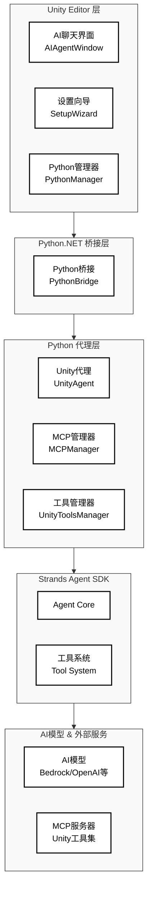

# Unity Strands Agent 智能助手插件

Unity Strands Agent 是基于 AWS 开源 Strands Agent SDK 的 Unity 开发智能助手，为 Unity 开发者提供智能代码生成、项目优化建议和实时问答支持。


## 项目概述

Unity Strands Agent 将先进的 AI 能力直接集成到 Unity 编辑器中，通过深度理解 Unity 开发流程，为开发者提供智能化的开发辅助。该插件基于模块化架构设计，支持多种 AI 模型，并提供丰富的工具生态系统。

## 主要特性

### Unity 集成优势

#### 深度工作流整合

- **项目结构理解**: 智能识别 Unity 项目结构，提供针对性的代码生成和问题解决方案
- **组件管理**: 自动处理 GameObject 和组件依赖关系，确保代码符合 Unity 最佳实践
- **性能优化**: 基于 Unity 特定的性能瓶颈分析，提供针对性的优化建议

#### 工具生态系统

- **预构建工具**: 提供 20+ 个开箱即用的工具，包括文件操作、API 调用、数学计算等
- **MCP 协议支持**: 通过 Model Context Protocol 访问社区开发的工具服务器
- **Unity 专属工具**: 编辑器深度集成工具，支持菜单执行、对象操作、包管理等功能

#### 企业级功能

- **AI 模型集成**: 当前支持 Amazon Bedrock，其他主流 AI 服务（Anthropic、OpenAI、Meta Llama 等）支持开发中
- **上下文记忆**: 智能记住项目偏好和代码风格，提供个性化开发建议
- **团队协作**: 学习团队编码规范，自动调整代码以符合团队标准

## 快速开始

### 系统要求

- **Unity**: 2022.3 LTS 或更高版本
- **操作系统**: macOS 10.15+ / Windows 10+ / Ubuntu 18.04+
- **Python**: 3.10 或更高版本（支持自动检测和配置）
- **Node.js**: 16.0 或更高版本（用于 MCP 工具支持）
- **AI 模型访问**: 需要配置 AWS CLI 凭证以使用 Amazon Bedrock 服务

### 安装方法

#### 方法一：Unity Package Manager（推荐）

1. 在 Unity 中打开 Package Manager
2. 点击 "Add package from git URL"
3. 输入：`https://github.com/ddpie/unity-strands-agent.git`
4. 等待 Unity 自动下载和导入

#### 方法二：本地开发安装

```bash
git clone https://github.com/ddpie/unity-strands-agent.git
cd unity-strands-agent
```

然后在 Unity Package Manager 中选择 "Add package from disk"，选择项目中的 `package.json` 文件。

### 配置步骤

1. **路径配置**
   - 打开 Unity 菜单 → Window → AI助手 → 设置向导
   - 切换到"路径配置"标签页，配置系统依赖路径
   - 使用"自动检测"功能快速配置常见路径

   

2. **环境安装**
   - 在"环境安装"标签页中点击"开始自动设置"
   - 系统将自动完成 Python 环境、Strands Agent SDK 和依赖包的安装

   

3. **MCP 配置**
   - 在"MCP配置"标签页中配置外部工具和服务
   - 根据需要添加和配置 MCP 服务器

   

4. **模型配置**
   - 配置 AWS CLI 凭证以使用 Amazon Bedrock 服务
   - 详细配置说明请参考 [Strands Agent SDK 官方文档](https://strandsagents.com/latest/)

5. **开始使用**
   - 打开 Unity 菜单 → Window → AI助手 → 聊天
   - 输入问题或需求，例如："帮我创建一个角色控制器脚本"

## 系统架构

### 架构概述

Unity Strands Agent 采用分层式架构设计，分为五个主要层次，每层负责特定的功能模块，确保系统的模块化、可扩展性和维护性。



#### 架构层次说明

**Unity Editor 层**

- **AI聊天界面 (AIAgentWindow)**: 提供对话式交互体验，支持实时问答和代码生成，包含流式处理和线程保护机制
- **设置向导 (SetupWizard)**: 自动化环境配置，完成 Python 环境、依赖包和模型设置
- **Python管理器 (PythonManager)**: 管理 Python 环境初始化、虚拟环境创建和依赖包安装

**Python.NET 桥接层**

- **Python桥接 (PythonBridge)**: 提供 C# 和 Python 之间的高性能双向通信，确保类型安全和异常处理

**Python 代理层**

- **Unity代理 (UnityAgent)**: 专门优化的 AI 代理，深度理解 Unity 开发模式和最佳实践
- **MCP管理器 (MCPManager)**: 管理 Model Context Protocol 连接，动态加载和卸载工具服务器
- **工具管理器 (UnityToolsManager)**: 统一管理所有可用工具，提供工具追踪和性能监控

**Strands Agent SDK 层**

- **Agent Core**: Strands 框架的核心推理引擎，实现模型驱动的智能决策和对话管理
- **工具系统 (Tool System)**: 统一的工具调用框架，支持同步/异步工具执行

**AI模型 & 外部服务层**

- **AI模型**: 当前支持通过 AWS CLI 本地凭证调用 Amazon Bedrock 服务，基于 Strands Agent SDK 的灵活架构，可轻松扩展支持其他模型提供商（详见 [Strands 官方文档](https://strandsagents.com/latest/)）
- **MCP服务器**: Unity 专属和通用的工具服务器，提供编辑器操作、文档查询、文件管理等功能

### 工具生态系统

#### Strands 预定义工具集

系统提供 20+ 个开箱即用的核心工具：

```text
核心工具集:
├── file_read        # 智能文件读取和代码分析
├── file_write       # 精确文件写入，保持代码风格
├── editor           # 高级代码编辑和查找替换
├── shell            # 系统命令执行和构建流程自动化
├── python_repl      # Python 代码执行和原型验证
├── calculator       # 数学计算和向量运算
├── memory           # 上下文记忆和项目偏好学习
├── current_time     # 时间获取和日志时间戳生成
├── http_request     # API 调用和文档查询
├── retrieve         # 语义搜索和知识库检索
├── thinking         # 深度分析思考和多轮推理
├── workflow         # 工作流编排和任务序列管理
├── graph            # 图结构处理和关系分析
├── swarm            # 群体智能和多代理协作
├── agent2agent      # 代理间通信和 A2A 协议
└── ...              # 更多工具持续增加
```

#### MCP 协议生态系统

Model Context Protocol (MCP) 是 Strands Agent SDK 的核心集成协议，提供标准化的工具接口。

**主要优势:**

- **标准化接口**: 统一的工具调用协议，简化集成过程
- **丰富的工具库**: 访问社区开发的工具服务器
- **社区驱动**: 活跃的开源社区持续贡献新工具
- **即插即用**: 通过配置即可集成新的工具能力

**Unity 专属 MCP 工具集**

Unity 编辑器深度集成工具，提供菜单执行、对象操作、包管理、测试运行、日志输出、组件更新、场景管理等功能。

详细工具说明请参考：[Unity MCP 工具集](https://github.com/CoderGamester/mcp-unity)

## 关于 Strands Agent SDK

Strands Agent SDK 是 AWS 推出的开源 AI 代理框架，采用模型驱动的方法，让开发者能够快速构建强大的 AI 代理。该框架连接代理的两个核心组件：模型和工具。

详细了解请访问：[Strands Agent SDK 官方文档](https://strandsagents.com/latest/)

### 核心特性

#### 设计理念

- **简单的代理循环**: 无需复杂的工作流定义，只需指定提示词和工具列表
- **完全可定制**: 框架具有高度灵活性，可根据需求深度定制代理行为
- **模型驱动决策**: 利用 LLM 的推理能力自动规划和执行任务序列

#### 生产环境支持

- **完整的观测性**: 内置 OpenTelemetry 支持，提供追踪、指标和日志
- **多种部署选项**: 支持 AWS Lambda、Fargate、EC2 等部署方式
- **企业级安全**: 优先考虑安全性和数据保护

#### 模型兼容性

- **模型支持**: 当前支持 Amazon Bedrock，基于 Strands Agent SDK 架构可轻松扩展支持 Anthropic、OpenAI、Meta Llama、Ollama 等模型
- **跨平台部署**: 可在云端、混合环境或本地运行
- **灵活集成**: Strands Agent SDK 提供简单的模型接入机制，详见 [官方文档](https://strandsagents.com/latest/)

#### 多智能体协作

- **智能体网络**: 支持多个专业化代理协作解决复杂问题
- **工作流编排**: 可构建监督者-专家模型和层次化架构
- **自主代理**: 支持自我改进和长期自主运行的代理

#### 开源社区

- **企业支持**: Anthropic、Meta、PwC、Accenture 等公司积极贡献
- **开源协议**: Apache 2.0 许可，支持商业使用和定制开发
- **活跃社区**: 快速发展的开源社区，持续改进和扩展功能

## 路径配置系统

### 概述

路径配置系统提供统一的路径管理，将系统依赖路径提取到可配置界面中，方便用户根据不同环境进行调整。该功能已集成到 AI 助手的设置界面中。

### 主要功能

- **集成配置界面**: 路径配置集成在 AI 助手设置界面中
- **相对路径支持**: 优先使用相对路径，便于项目迁移
- **自动检测**: 自动检测常见的路径位置
- **配置验证**: 实时验证配置的有效性
- **智能路径选择**: 按优先级自动选择有效路径

### 使用方法

1. **打开配置界面**
   在 Unity Editor 中选择菜单：`Window > AI助手 > 设置向导`，切换到"路径配置"标签页

2. **基本路径配置**
   - **项目根目录**: Unity 项目的根目录，其他相对路径基于此目录
   - **Node.js 配置**: 主要和备用 Node.js 可执行文件路径
   - **Unity AI 代理 Python 模块路径**: Unity AI 代理 Python 模块路径
   - **系统 Shell 配置**: Shell 可执行文件路径（默认为 /bin/bash）

3. **高级路径配置**
   - **Python 路径列表**: 按优先级排序的 Python 可执行文件路径
   - **Node.js 路径列表**: 按优先级排序的 Node.js 可执行文件路径
   - **SSL 证书配置**: SSL 证书文件和目录路径列表

4. **自动检测功能**
   - 点击"自动检测"按钮，系统会自动搜索和设置常见路径位置
   - 点击"全部自动检测"按钮，一键检测并配置所有路径
   - 系统按优先级搜索配置的路径，自动选择第一个有效路径

### 配置文件

配置保存在 `Assets/UnityAIAgent/PathConfiguration.asset` 文件中，会自动加载。

### 环境变量

系统会自动设置以下环境变量供Python脚本使用：

- `STRANDS_TOOLS_PATH`：Strands工具路径
- `NODE_EXECUTABLE_PATH`：Node.js可执行文件路径
- `MCP_CONFIG_PATH`：MCP配置文件路径
- `MCP_UNITY_SERVER_PATH`：MCP Unity服务器路径
- `PROJECT_ROOT_PATH`：项目根目录
- `SSL_CERT_FILE_PATH`：SSL证书文件路径
- `SSL_CERT_DIR_PATH`：SSL证书目录路径
- `SHELL_EXECUTABLE_PATH`：Shell可执行文件路径

### 相对路径说明

系统优先使用相对路径，相对于项目根目录：

- `Assets/UnityAIAgent/mcp_config.json` - MCP配置文件
- `Library/PackageCache/com.gamelovers.mcp-unity@xxx/Server/build/index.js` - MCP服务器
- `~/.nvm/current/bin/node` - Node.js（用户主目录相对路径）

### 故障排除

1. **路径不存在错误**：
   - 使用"验证配置"功能检查所有路径
   - 使用"自动检测"功能重新检测路径
   - 手动使用"浏览"功能设置正确路径

2. **Python模块找不到**：
   - 检查Strands工具路径是否正确
   - 确保STRANDS_TOOLS_PATH环境变量已设置

3. **MCP连接失败**：
   - 验证Node.js路径和MCP服务器路径
   - 检查MCP配置文件是否存在

### 开发说明

#### 添加新的配置路径

1. 在 `PathConfiguration.cs` 中添加新的字段
2. 在 `SetupWizard.cs` 的路径配置界面中添加UI控件
3. 在 `PathManager.cs` 中添加获取方法
4. 在 `PythonManager.cs` 中设置相应的环境变量

#### 使用配置的路径

在代码中，使用 `PathManager` 来获取配置的路径：

```csharp
// 获取Node.js路径
string nodePath = PathManager.GetNodeExecutablePath();

// 获取MCP服务器路径
string mcpServerPath = PathManager.GetMCPUnityServerPath();
```

在Python脚本中，使用环境变量：

```python
import os

# 获取Strands工具路径
strands_path = os.environ.get('STRANDS_TOOLS_PATH')

# 获取MCP配置路径
mcp_config_path = os.environ.get('MCP_CONFIG_PATH')
```

## 开发者指南

### 项目结构

```text
unity-strands-agent/
├── Editor/                    # Unity 编辑器集成
│   ├── AIAgentWindow.cs       # 主聊天界面
│   ├── SetupWizard.cs         # 自动化配置向导
│   ├── MCPConfiguration.cs    # MCP 工具配置管理
│   ├── PythonBridge.cs        # Python.NET 桥接层
│   ├── StreamingHandler.cs    # 实时流式响应处理
│   ├── ThreadProtection.cs    # 线程安全保护
│   ├── PathConfiguration.cs   # 路径配置系统
│   └── PathManager.cs         # 路径管理器
├── Python/                    # Python AI 代理层
│   ├── unity_agent.py         # Unity 专用 AI 代理
│   ├── unity_system_prompt.py # Unity 专业提示词
│   ├── unity_tools.py         # 工具管理系统
│   ├── streaming_processor.py # 流式处理器
│   ├── mcp_manager.py         # MCP 协议管理器
│   ├── tool_tracker.py        # 工具使用追踪
│   ├── ssl_config.py          # SSL 安全配置
│   └── diagnostic_utils.py    # 系统诊断工具
└── Runtime/                   # 运行时组件（可选）
    └── RuntimeAIAssistant.cs  # 运行时 AI 助手接口
```

## 相关链接

- **Strands Agent SDK**: [官方文档](https://strandsagents.com/latest/)
- **Unity MCP 工具集**: [GitHub](https://github.com/CoderGamester/mcp-unity)
- **问题反馈**: [GitHub Issues](https://github.com/ddpie/unity-strands-agent/issues)

## 开源协议

本项目采用 MIT License 开源协议，支持商业使用和定制开发。

Strands Agent SDK 相关组件请参考其[官方许可协议](https://strandsagents.com/latest/)。
