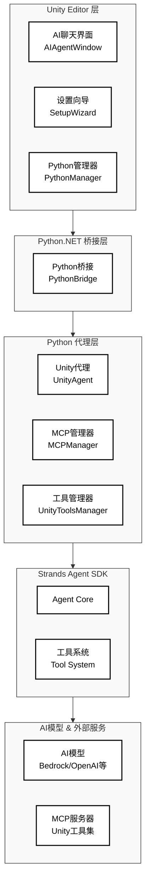

# Unity Strands Agent 智能助手插件

> **基于 Strands Agent SDK 的企业级 Unity 开发智能助手**  
> 让您快速构建符合业务需求的深度定制化AI助手


## 项目概述

Unity Strands Agent 是一个专为Unity开发者设计的AI智能助手插件，基于AWS开源的Strands Agent SDK构建。它将强大的AI能力直接集成到Unity编辑器中，为您提供智能代码生成、项目优化建议、实时问答等功能，显著提升Unity开发效率。

## 主要特性

### Unity专属集成优势

**Unity专业工作流集成**
- **深度理解Unity开发流程** - 智能识别Unity项目结构，提供专业级代码生成和问题解决
- **场景和组件管理** - 自动处理GameObject、组件依赖关系，生成符合Unity最佳实践的代码
- **性能优化建议** - 基于Unity特定的性能瓶颈，提供针对性的优化方案

**强大的工具生态系统**
- **预构建工具** - 提供20+个开箱即用的工具（文件操作、API调用、计算器等）
- **MCP协议集成** - 访问数千个Model Context Protocol服务器和工具
- **Unity专属MCP工具集** - Unity编辑器深度集成工具，提供菜单执行、对象操作、包管理等功能

**企业级特性**
- **多模型支持** - 支持Amazon Bedrock、Anthropic、OpenAI、Meta Llama等主流AI服务
- **上下文记忆系统** - 智能记住项目偏好、代码风格，提供个性化开发建议
- **团队协作优化** - 学习团队编码规范，自动调整代码以符合团队标准

## 快速体验：5分钟部署您的AI助手

### 系统要求

- **Unity**: 2022.3 LTS+ (支持最新LTS版本)
- **操作系统**: macOS 10.15+ / Windows 10+ / Ubuntu 18.04+
- **Python**: 3.10+ (自动检测和配置)
- **Node.js**: 16.0+ (MCP工具支持，自动安装)
- **AI模型访问**: 支持AWS Bedrock、Anthropic、OpenAI、Meta Llama等 (可选择任一提供商)

### 一键安装流程

#### 方法1：Unity Package Manager (推荐)

```bash
# 1. 添加包到Unity项目
Unity Package Manager → Add package from git URL
输入: https://github.com/ddpie/unity-strands-agent.git

# 2. 自动配置向导
Unity菜单 → Window → AI助手 → 设置向导
点击"开始自动设置" → 等待完成 (约2-3分钟)
```

#### 方法2：本地开发安装

```bash
# 克隆项目
git clone https://github.com/ddpie/unity-strands-agent.git
cd unity-strands-agent

# Unity Package Manager → Add package from disk
选择项目中的 package.json 文件
```

### 3步完成配置

1. **环境自动配置**
   - Python虚拟环境创建
   - Strands Agent SDK安装  
   - MCP工具包下载
   - SSL证书配置

2. **AI模型配置**
   - 支持多种AI模型提供商：AWS Bedrock、Anthropic、OpenAI、Meta Llama等
   - 详细配置说明请参考：[Strands Agent SDK官方文档](https://strandsagents.com/latest/)

3. **开始使用**
   ```
   Unity菜单 → Window → AI助手 → 聊天
   输入: "帮我创建一个角色控制器脚本"
   ```

## 系统架构：模块化设计，灵活扩展

### 核心架构组件

Unity Strands Agent 采用分层式架构设计，从上到下分为五个主要层次，每层负责特定的功能模块，确保系统的模块化、可扩展性和维护性。



#### 架构层次详解

**1. Unity Editor 层 - 用户交互前端**
- **AI聊天界面 (AIAgentWindow)** - 提供直观的对话式交互体验，支持实时问答和代码生成，包含流式处理和线程保护机制
- **设置向导 (SetupWizard)** - 自动化环境配置，一键完成Python环境、依赖包和模型设置，包含MCP配置界面
- **Python管理器 (PythonManager)** - 管理Python环境初始化、虚拟环境创建和依赖包安装，确保Python运行环境稳定

**2. Python.NET 桥接层 - 跨语言通信**
- **Python桥接 (PythonBridge)** - 提供C#和Python之间的高性能双向通信，确保Unity编辑器能够无缝调用Python AI功能，同时保持类型安全和异常处理

**3. Python 代理层 - AI核心逻辑**
- **Unity代理 (UnityAgent)** - 专门优化的AI代理，深度理解Unity开发模式和最佳实践，封装Strands Agent SDK核心功能
- **MCP管理器 (MCPManager)** - 管理Model Context Protocol连接，动态加载和卸载工具服务器，处理外部工具集成
- **工具管理器 (UnityToolsManager)** - 统一管理所有可用工具，包括Strands预定义工具和外部MCP工具，提供工具追踪和性能监控

**4. Strands Agent SDK 层 - 核心AI框架**
- **Agent Core** - Strands框架的核心推理引擎，实现模型驱动的智能决策和对话管理
- **工具系统 (Tool System)** - 统一的工具调用框架，支持同步/异步工具执行，包含MCP客户端功能

**5. AI模型 & 外部服务层 - 能力提供者**
- **AI模型** - 集成Amazon Bedrock、Anthropic、OpenAI、Meta Llama等主流AI服务，提供多模型支持
- **MCP服务器** - Unity专属和通用的工具服务器，提供编辑器操作、文档查询、文件管理等扩展功能

### 工具生态系统

#### 1. **Strands 预定义工具集** (20+个核心工具)
```python
官方预构建工具集:
├── file_read        # 智能文件读取，支持代码分析
├── file_write       # 精确文件写入，保持代码风格
├── editor           # 高级代码编辑，支持查找替换
├── shell            # 系统命令执行，构建流程自动化
├── python_repl      # Python代码执行，原型验证
├── calculator       # 数学计算，向量运算优化
├── memory           # 上下文记忆，项目偏好学习
├── current_time     # 时间获取，日志时间戳生成
├── http_request     # API调用，文档查询
├── retrieve         # 语义搜索，知识库检索
├── thinking         # 深度分析思考，多轮推理
├── workflow         # 工作流编排，任务序列管理
├── graph            # 图结构处理，关系分析
├── swarm            # 群体智能，多代理协作
├── agent2agent      # 代理间通信，A2A协议
└── ...             # 更多工具持续增加
```

#### 2. **MCP协议生态系统**
**Model Context Protocol (MCP)** 是Strands Agent SDK的核心集成协议，提供标准化的工具接口，让代理能够访问数千个社区开发的工具服务器：

**MCP的优势**
- **标准化接口** - 统一的工具调用协议，无需为每个工具编写定制集成代码
- **丰富的工具库** - 访问数千个已发布的MCP服务器和工具
- **社区驱动** - 活跃的开源社区持续贡献新的工具和服务器
- **即插即用** - 通过简单的配置即可集成新的工具能力

**Unity专属MCP工具集**
Unity编辑器深度集成工具，提供菜单执行、对象操作、包管理、测试运行、日志输出、组件更新、场景管理等功能。

详细工具说明和使用方法请参考：[Unity MCP工具集](https://github.com/CoderGamester/mcp-unity)

## 关于 Strands Agent SDK

**Strands Agent SDK** 是AWS推出的开源AI代理框架，采用模型驱动的方法（model-driven approach），让开发者能够用几行代码就构建出强大的AI代理。正如官方所述，Strands"连接代理的两个核心组件：模型和工具"，如同DNA的双螺旋结构（详细了解请访问：[Strands Agent SDK官方文档](https://strandsagents.com/latest/)）：

**轻量级且直观**
- **简单的代理循环** - 无需复杂的工作流定义，只需指定提示词和工具列表
- **完全可定制** - 框架灵活性强，可根据需求深度定制代理行为
- **模型驱动决策** - 利用LLM的推理能力自动规划和执行任务序列

**生产就绪**
- **完整的观测性** - 内置OpenTelemetry支持，提供追踪、指标和日志
- **多种部署选项** - 支持AWS Lambda、Fargate、EC2等多种部署方式
- **企业级安全** - 优先考虑安全性和数据保护，负责任地运行代理

**模型和供应商无关**
- **多模型支持** - 支持Amazon Bedrock、Anthropic、OpenAI、Meta Llama、Ollama等
- **跨平台部署** - 可在云端、混合环境或本地运行
- **灵活集成** - 通过LiteLLM支持更多模型提供商

**多智能体协作**
- **智能体网络** - 支持多个专业化代理协作解决复杂问题
- **工作流编排** - 可构建监督者-专家模型和层次化架构
- **自主代理** - 支持自我改进和长期自主运行的代理

**开源社区支持**
- **多家公司贡献** - Anthropic、Meta、PwC、Accenture等公司积极贡献
- **Apache 2.0许可** - 开源协议，支持商业使用和定制开发
- **活跃社区** - 快速发展的开源社区，持续改进和扩展功能

## 路径配置系统

### 概述

本系统提供了统一的路径配置管理，将之前硬编码的路径提取到可配置的界面中，方便不同用户根据自己的环境进行调整。路径配置功能已集成到AI助手的设置界面中。

### 功能特性

- **集成配置界面**：路径配置集成在AI助手设置界面中
- **相对路径支持**：优先使用相对路径，便于项目迁移
- **自动检测**：自动检测常见的路径位置
- **浏览功能**：提供文件/文件夹浏览器
- **配置验证**：实时验证配置的有效性
- **智能路径选择**：按优先级自动选择有效路径

### 使用方法

#### 1. 打开配置界面

在Unity Editor中，选择菜单：`Window > AI助手 > 设置向导`，然后切换到"路径配置"标签页

#### 2. 环境设置标签页

这是原有的自动安装和配置功能，包含Python环境、依赖包安装等步骤。

#### 3. 路径配置标签页

**基本路径配置：**
- **项目根目录**：Unity项目的根目录，其他相对路径基于此目录
- **Node.js配置**：主要和备用Node.js可执行文件路径
- **Strands工具配置**：Strands工具源码路径
- **系统Shell配置**：Shell可执行文件路径（默认为/bin/bash）

**高级路径配置：**
- **Python路径列表**：按优先级排序的Python可执行文件路径
- **Node.js路径列表**：按优先级排序的Node.js可执行文件路径  
- **SSL证书配置**：SSL证书文件和目录路径列表，支持自定义证书位置

#### 4. MCP配置标签页

这是原有的MCP服务器配置功能，用于配置外部工具和服务连接。

#### 5. 自动检测功能

- 点击各个"自动检测"按钮，系统会自动搜索和设置常见的路径位置
- 点击"全部自动检测"按钮，一键检测并配置所有路径
- 系统会按优先级搜索配置的路径，自动选择第一个有效的路径

### 配置文件

配置保存在 `Assets/UnityAIAgent/PathConfiguration.asset` 文件中，会自动加载。

### 环境变量

系统会自动设置以下环境变量供Python脚本使用：

- `STRANDS_TOOLS_PATH`：Strands工具路径
- `NODE_EXECUTABLE_PATH`：Node.js可执行文件路径
- `MCP_CONFIG_PATH`：MCP配置文件路径
- `MCP_UNITY_SERVER_PATH`：MCP Unity服务器路径
- `PROJECT_ROOT_PATH`：项目根目录
- `SSL_CERT_FILE_PATH`：SSL证书文件路径
- `SSL_CERT_DIR_PATH`：SSL证书目录路径
- `SHELL_EXECUTABLE_PATH`：Shell可执行文件路径

### 相对路径说明

系统优先使用相对路径，相对于项目根目录：

- `Assets/UnityAIAgent/mcp_config.json` - MCP配置文件
- `Library/PackageCache/com.gamelovers.mcp-unity@xxx/Server/build/index.js` - MCP服务器
- `~/.nvm/current/bin/node` - Node.js（用户主目录相对路径）

### 故障排除

1. **路径不存在错误**：
   - 使用"验证配置"功能检查所有路径
   - 使用"自动检测"功能重新检测路径
   - 手动使用"浏览"功能设置正确路径

2. **Python模块找不到**：
   - 检查Strands工具路径是否正确
   - 确保STRANDS_TOOLS_PATH环境变量已设置

3. **MCP连接失败**：
   - 验证Node.js路径和MCP服务器路径
   - 检查MCP配置文件是否存在

### 开发说明

#### 添加新的配置路径

1. 在 `PathConfiguration.cs` 中添加新的字段
2. 在 `SetupWizard.cs` 的路径配置界面中添加UI控件
3. 在 `PathManager.cs` 中添加获取方法
4. 在 `PythonManager.cs` 中设置相应的环境变量

#### 使用配置的路径

在代码中，使用 `PathManager` 来获取配置的路径：

```csharp
// 获取Node.js路径
string nodePath = PathManager.GetNodeExecutablePath();

// 获取MCP服务器路径
string mcpServerPath = PathManager.GetMCPUnityServerPath();
```

在Python脚本中，使用环境变量：

```python
import os

# 获取Strands工具路径
strands_path = os.environ.get('STRANDS_TOOLS_PATH')

# 获取MCP配置路径
mcp_config_path = os.environ.get('MCP_CONFIG_PATH')
```

## 开发者指南

### 项目结构概览

```
unity-strands-agent/
├── Editor/                    # Unity编辑器集成
│   ├── AIAgentWindow.cs       # 主聊天界面
│   ├── SetupWizard.cs         # 自动化配置向导
│   ├── MCPConfiguration.cs    # MCP工具配置管理
│   ├── PythonBridge.cs        # Python.NET桥接层
│   ├── StreamingHandler.cs    # 实时流式响应处理
│   ├── ThreadProtection.cs    # 线程安全保护
│   ├── PathConfiguration.cs   # 路径配置系统
│   └── PathManager.cs         # 路径管理器
├── Python/                    # Python AI代理层
│   ├── unity_agent.py         # Unity专用AI代理
│   ├── unity_system_prompt.py # Unity专业提示词
│   ├── unity_tools.py         # 工具管理系统
│   ├── streaming_processor.py # 流式处理器
│   ├── mcp_manager.py         # MCP协议管理器
│   ├── tool_tracker.py        # 工具使用追踪
│   ├── ssl_config.py          # SSL安全配置
│   └── diagnostic_utils.py    # 系统诊断工具
└── Runtime/                   # 运行时组件(可选)
    └── RuntimeAIAssistant.cs  # 运行时AI助手接口
```

## 相关链接

- **Strands Agent SDK**: [官方文档](https://strandsagents.com/latest/)
- **Unity MCP工具集**: [GitHub](https://github.com/CoderGamester/mcp-unity)
- **问题反馈**: [GitHub Issues](https://github.com/ddpie/unity-strands-agent/issues)

## 开源协议

本项目采用 **MIT License** 开源协议，支持商业使用和定制开发。

**Strands Agent SDK** 相关组件请参考其[官方许可协议](https://strandsagents.com/latest/)。