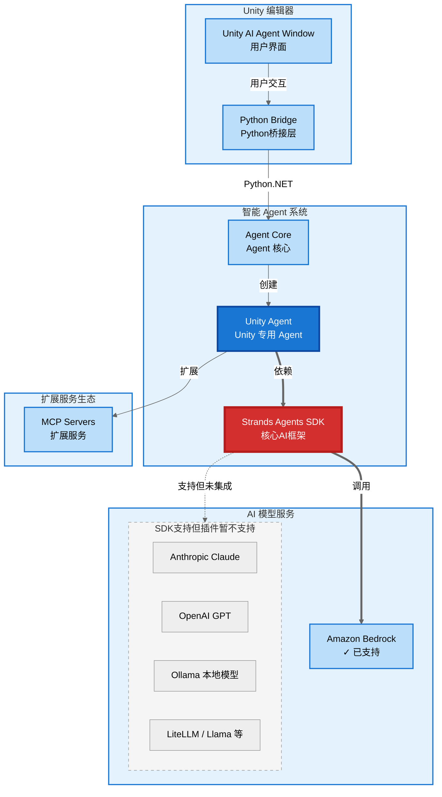
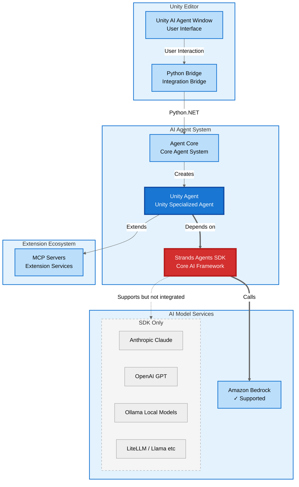

# Unity Strands Agent

基于 AWS [Strands Agents SDK](https://strandsagents.com/latest/) 的 Unity 编辑器 AI 插件，在 Unity 编辑器中直接与 AI 对话，获得智能代码生成、问题解答和开发建议。

**Language / 语言**: [中文](#中文版本) | [English](#english-version)

---

## 中文版本

Unity Strands Agent 将先进的 AI 能力直接集成到 Unity 编辑器中，通过深度理解 Unity 开发流程，为开发者提供智能化的开发辅助。

基于 [Strands Agents SDK](https://strandsagents.com/latest/) 开发智能助手极其简单，核心代码展示了其优雅的设计：

```python
from strands import Agent
from unity_tools import get_unity_tools

class UnityAgent:
    def __init__(self):
        # 获取 Unity 开发工具集
        unity_tools = get_unity_tools()
        
        # 一行代码创建强大的 AI Agent
        self.agent = Agent(
            system_prompt=UNITY_SYSTEM_PROMPT, 
            tools=unity_tools
        )
    
    def process_message(self, message: str):
        # 直接调用 Agent 处理消息
        return self.agent(message)
```

仅需这几行代码，即可创建一个理解 Unity 开发上下文、配备 21+ 专业工具的智能助手。该插件基于模块化架构设计，轻松扩展工具集，并提供丰富的工具生态系统。

### 系统架构



### 主要特性

- **项目结构理解**: 智能识别 Unity 项目结构，提供针对性的代码生成和问题解决方案
- **组件管理**: 自动处理 GameObject 和组件依赖关系，确保代码符合 Unity 最佳实践
- **性能优化**: 基于 Unity 特定的性能瓶颈分析，提供针对性的优化建议
- **丰富的内置工具**: 提供 21+ 个预构建工具，涵盖文件操作、API 调用、数学计算、AI 服务、工作流管理等
- **MCP 协议支持**: 通过 Model Context Protocol 扩展第三方工具和服务集成能力
- **一键式环境配置**: 自动检测 Python 3.11，创建虚拟环境，安装依赖，无需手动配置
- **多 AI 模型支持**: [Strands Agents SDK](https://strandsagents.com/latest/) 支持 Claude、GPT、Llama 等主流 AI 模型，但本插件当前版本仅支持 Bedrock US Oregon (us-west-2) 区域的 Claude 3.7 Sonnet，计划将来支持其他模型
- **智能上下文记忆**: 自动记住项目偏好和代码风格，提供个性化开发建议
- **简化的用户界面**: 隐藏复杂配置，专注核心功能，提升开发效率

### 快速开始

#### 系统要求

- Unity 2022.3 LTS 或更高版本
- Python 3.11（插件会自动检测和配置）
- AWS credentials 配置（默认使用 Amazon Bedrock 服务，默认模型为 US Oregon (us-west-2) 区域的 Claude 3.7 Sonnet）
- **仅支持 macOS 系统**

**重要**: 
- 本插件专门针对 Python 3.11 进行了优化，不支持其他 Python 版本。在 macOS 上可通过 `brew install python@3.11` 安装。
- 环境初始化将在点击 Environment Setup 的 Start Setup 按钮时进行，请耐心等待安装过程完成。

#### 安装方法

通过 Unity Package Manager 安装：

1. 在 Unity 中打开 Package Manager
2. 点击 "+" 按钮
3. 选择 "Add package from git URL"
4. 输入：`https://github.com/ddpie/unity-strands-agent.git`
5. 点击 "Add" 并等待 Unity 自动下载和导入

#### 配置步骤

1. 在 Unity 中选择菜单：Window → Unity Strands Agent
2. 点击 "Settings" 标签页，然后点击 "Environment Setup"
3. 点击 "Start Setup" 按钮开始自动安装
4. 系统将自动完成环境检测、虚拟环境创建、依赖安装等步骤
5. 配置完成后，点击 "Open AI Assistant" 开始使用

### 使用指南

1. 在 Unity 中选择菜单 Window → Unity Strands Agent
2. 在聊天界面输入问题或需求
3. Unity Strands Agent 将提供代码生成、优化建议和问题解决方案

**视频教程**: [Unity Strands Agent 功能演示](https://www.bilibili.com/video/BV1jgGJzhEZs/)


主要功能包括：
- 项目结构分析和组件关系理解
- 根据需求生成符合项目风格的 C# 脚本
- 提供针对性的性能优化建议
- 帮助诊断和解决常见的 Unity 开发问题

### 环境配置

插件会自动设置以下环境变量：

- `PROJECT_ROOT_PATH`：项目根目录路径
- `STRANDS_TOOLS_PATH`：Strands工具路径

配置文件保存在 `Assets/UnityAIAgent/PathConfiguration.asset` 中，会自动加载。插件使用 AWS credentials 配置文件访问 Bedrock 服务。

**MCP 服务器配置**：在 `Assets/UnityAIAgent/mcp_config.json` 中配置 MCP 服务器时，建议使用绝对路径配置 `command` 字段，例如：
```json
{
  "mcpServers": {
    "mcp-unity": {
      "command": "/usr/local/bin/node",
      "args": ["/path/to/your/mcp-server/index.js"]
    }
  }
}
```

### 故障排除

**菜单项不显示**
- 检查Unity控制台是否有编译错误
- 确认包已正确下载到Library/PackageCache目录
- 重启Unity编辑器

**Python 3.11 环境问题**
- 确认系统已安装 Python 3.11：`python3.11 --version`
- 在 macOS 上安装：`brew install python@3.11`
- 重新运行"Environment Setup"进行自动配置

**找不到agent_core模块**
- 运行"Environment Setup"重新安装Python依赖
- 检查Library/PackageCache中是否有com.ddpie.unity-strands-agent包
- 确认虚拟环境在项目Python目录中正确创建

如有问题，请检查Unity控制台的错误日志，并在设置页面点击"验证配置"查看当前配置状态。

### 支持和反馈

- **文档**: [Strands Agents SDK 官方文档](https://strandsagents.com/latest/)
- **问题反馈**: [GitHub Issues](https://github.com/ddpie/unity-strands-agent/issues)

---

## English Version

Unity Strands Agent is a powerful AI-powered development assistant that brings the capabilities of AWS's open-source [Strands Agents SDK](https://strandsagents.com/latest/) directly into the Unity Editor. This plugin transforms your Unity development workflow by providing intelligent code generation, automated problem-solving, and context-aware development suggestions.

Building intelligent assistants with the [Strands Agents SDK](https://strandsagents.com/latest/) is remarkably simple. The core implementation showcases its elegant design:

```python
from strands import Agent
from unity_tools import get_unity_tools

class UnityAgent:
    def __init__(self):
        # Load Unity-specific development tools
        unity_tools = get_unity_tools()
        
        # Create a powerful AI Agent with just one line
        self.agent = Agent(
            system_prompt=UNITY_SYSTEM_PROMPT, 
            tools=unity_tools
        )
    
    def process_message(self, message: str):
        # Simply call the Agent to process messages
        return self.agent(message)
```

With just these few lines of code, you can create an intelligent assistant that understands Unity development context and comes equipped with 21+ professional tools. Built on a modular architecture, this plugin makes it easy to extend the toolset while providing a rich ecosystem of development utilities.

### System Architecture



### Key Features

- **Intelligent Project Analysis**: Automatically scans and understands your Unity project structure, scene hierarchies, and asset dependencies
- **Component-Aware Development**: Generates code that properly handles Unity's component lifecycle, serialization, and GameObject relationships
- **Performance-First Approach**: Identifies Unity-specific performance bottlenecks and suggests optimizations for draw calls, batching, and memory usage
- **21+ Built-in Tools**: Complete toolkit for file operations, code analysis, API integration, mathematical computations, and workflow automation
- **MCP Protocol Support**: Seamlessly integrate external tools and services through the Model Context Protocol for unlimited extensibility
- **One-Click Environment Setup**: Automatically detects Python 3.11, creates virtual environments, installs dependencies without manual configuration
- **Multiple AI Model Support**: The [Strands Agents SDK](https://strandsagents.com/latest/) supports Claude, GPT, Llama, and other leading AI models, but the current version of this plugin only supports Claude 3.7 Sonnet in Bedrock US Oregon (us-west-2) region, with plans to support other models in the future
- **Intelligent Context Memory**: Automatically remembers your project patterns, coding style, and preferences across sessions
- **Simplified User Interface**: Hides complex configurations, focuses on core functionality to boost development efficiency

### Quick Start

#### System Requirements

- Unity 2022.3 LTS or higher
- Python 3.11 (plugin automatically detects and configures)
- AWS credentials configuration (default model provider is Amazon Bedrock with Claude 3.7 Sonnet in the US Oregon (us-west-2) region)
- **macOS only**

**Important**: 
- This plugin is specifically optimized for Python 3.11 and does not support other Python versions. On macOS, install with `brew install python@3.11`.
- Environment initialization will occur when you click the Start Setup button in Environment Setup, please wait for the installation process to complete.

#### Installation

Through Unity Package Manager:

1. Open Package Manager in Unity
2. Click "+" button
3. Select "Add package from git URL"
4. Enter: `https://github.com/ddpie/unity-strands-agent.git`
5. Click "Add" and wait for Unity to automatically download and import

#### Configuration

1. In Unity, select menu: Window → Unity Strands Agent
2. Click "Settings" tab, then click "Environment Setup"
3. Click "Start Setup" button to begin automatic installation
4. The system will automatically complete environment detection, virtual environment creation, dependency installation
5. After configuration completes, click "Open AI Assistant" to start using

### Getting Started

1. Navigate to `Window → Unity Strands Agent` in Unity Editor
2. Type your development questions or describe what you want to build
3. Receive contextual code suggestions, explanations, and step-by-step solutions

**Video Demo**: [Unity Strands Agent Demo](https://www.bilibili.com/video/BV1jgGJzhEZs/)


Main capabilities include:
- Smart code analysis and suggestions that match your project's style
- Instant generation of production-ready C# scripts with proper Unity patterns
- Intelligent debugging and targeted solutions for Unity-specific issues
- Performance insights and optimization strategies for Unity projects

### Environment Configuration

The plugin automatically sets the following environment variables:

- `PROJECT_ROOT_PATH`: Project root directory path
- `STRANDS_TOOLS_PATH`: Strands tools path

Configuration is saved in `Assets/UnityAIAgent/PathConfiguration.asset` and will be automatically loaded. The plugin uses AWS credentials configuration files to access Bedrock services.

**MCP Server Configuration**: When configuring MCP servers in `Assets/UnityAIAgent/mcp_config.json`, it's recommended to use absolute paths for the `command` field, for example:
```json
{
  "mcpServers": {
    "mcp-unity": {
      "command": "/usr/local/bin/node",
      "args": ["/path/to/your/mcp-server/index.js"]
    }
  }
}
```

### Troubleshooting

**Menu Item Not Showing**
- Check Unity console for compilation errors
- Confirm package has been properly downloaded to Library/PackageCache directory
- Restart Unity Editor

**Python 3.11 Environment Issues**
- Confirm Python 3.11 is installed on system: `python3.11 --version`
- Install on macOS: `brew install python@3.11`
- Re-run "Environment Setup" for automatic configuration

**Cannot Find agent_core Module**
- Run "Environment Setup" to reinstall Python dependencies
- Check if com.ddpie.unity-strands-agent package exists in Library/PackageCache
- Confirm virtual environment is correctly created in project Python directory

If you encounter issues, check Unity console for error logs and click "Validate Configuration" in settings page to view current configuration status.

### Support and Feedback

- **Documentation**: [Strands Agents SDK Official Documentation](https://strandsagents.com/latest/)
- **Issue Reporting**: [GitHub Issues](https://github.com/ddpie/unity-strands-agent/issues)
