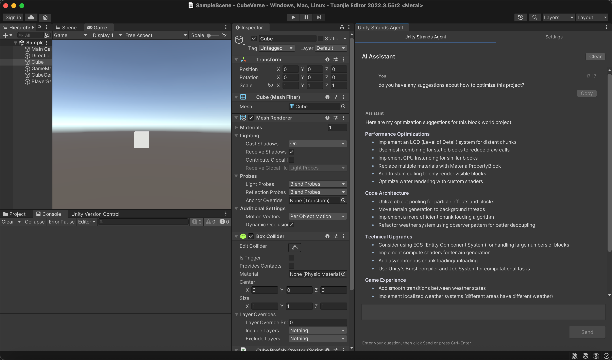

# Unity Strands Agent

**Language / 语言**: [中文](#中文版本) | [English](#english-version)

---

## 中文版本

Unity Strands Agent 是基于 AWS 开源 Strands Agent SDK 的 Unity 开发智能助手，为 Unity 开发者提供智能代码生成、项目优化建议和实时问答支持。


### 项目概述

Unity Strands Agent 将先进的 AI 能力直接集成到 Unity 编辑器中，通过深度理解 Unity 开发流程，为开发者提供智能化的开发辅助。该插件基于模块化架构设计，支持多种 AI 模型，并提供丰富的工具生态系统。

### 系统架构


### 主要特性

#### Unity 集成优势

##### 深度工作流整合

- **项目结构理解**: 智能识别 Unity 项目结构，提供针对性的代码生成和问题解决方案
- **组件管理**: 自动处理 GameObject 和组件依赖关系，确保代码符合 Unity 最佳实践
- **性能优化**: 基于 Unity 特定的性能瓶颈分析，提供针对性的优化建议

##### 工具生态系统

- **预构建工具**: 提供 21 个内置工具，涵盖文件操作、API 调用、数学计算、AI 服务、工作流管理等
- **MCP 协议支持**: 通过 Model Context Protocol 扩展第三方工具和服务集成能力
- **可选扩展**: 支持浏览器自动化、高级内存管理等可选功能模块

##### 企业级功能

- **AI 模型集成**: 当前支持 Amazon Bedrock，Strands Agent SDK 支持其他主流 AI 服务（Anthropic、OpenAI、Meta Llama 等）
- **上下文记忆**: 智能记住项目偏好和代码风格，提供个性化开发建议
- **团队协作**: 学习团队编码规范，自动调整代码以符合团队标准

### 快速开始

#### 系统要求

- **Unity**: 2022.3 LTS 或更高版本
- **操作系统**: macOS 10.15+ / Windows 10+ / Ubuntu 18.04+
- **Python**: 3.10 或更高版本（支持自动检测和配置）
- **Node.js**: 16.0 或更高版本（用于 MCP 工具支持）
- **AI 模型访问**: 需要配置 AWS CLI 凭证以使用 Amazon Bedrock 服务

#### 安装方法

##### 方法一：Unity Package Manager（推荐）

1. 在 Unity 中打开 Package Manager
2. 点击 "Add package from git URL"
3. 输入：`https://github.com/ddpie/unity-strands-agent.git`
4. 等待 Unity 自动下载和导入

##### 方法二：本地安装

1. 下载项目源码到本地
2. 在 Unity Package Manager 中选择 "Add package from disk"
3. 选择项目中的 `package.json` 文件

#### 配置步骤

1. **路径配置**
   - 打开 Unity 菜单 → Window → Unity Strands Agent
   - 切换到"设置"标签页，然后选择"路径配置"
   - 使用"自动检测"功能快速配置常见路径
   - 展开"查看/编辑环境变量"查看和管理所有环境变量

   

2. **环境安装**
   - 在"环境安装"标签页中点击"开始自动设置"
   - 系统将自动完成 Python 环境、Strands Agent SDK 和依赖包的安装

   

3. **MCP 配置**
   - 在"MCP配置"标签页中配置外部工具和服务
   - 根据需要添加和配置 MCP 服务器

   

4. **模型配置**
   - 配置 AWS CLI 凭证以使用 Amazon Bedrock 服务
   - 详细配置说明请参考 [Strands Agent SDK 官方文档](https://strandsagents.com/latest/)

### 使用指南

#### 基本功能

1. **打开 Unity Strands Agent**: 在 Unity 中选择菜单 Window → Unity Strands Agent
2. **开始对话**: 在聊天界面输入问题或需求
3. **查看建议**: Unity Strands Agent 将提供代码生成、优化建议和问题解决方案

#### 高级功能

- **项目分析**: Unity Strands Agent 能够分析整个项目结构，理解组件关系
- **代码生成**: 根据需求生成符合项目风格的 C# 脚本
- **性能优化**: 提供针对性的性能优化建议
- **问题诊断**: 帮助诊断和解决常见的 Unity 开发问题

### 路径配置系统

#### 概述

路径配置系统提供统一的路径管理，将系统依赖路径提取到可配置界面中，方便用户根据不同环境进行调整。该功能已集成到 Unity Strands Agent 的设置界面中。

#### 主要功能

- **集成配置界面**: 路径配置集成在 Unity Strands Agent 设置界面中
- **相对路径支持**: 优先使用相对路径，便于项目迁移
- **自动检测**: 自动检测常见的路径位置
- **配置验证**: 实时验证配置的有效性
- **智能路径选择**: 按优先级自动选择有效路径
- **环境变量管理**: 实时查看和编辑所有项目相关的环境变量

#### 使用方法

1. **打开配置界面**
   在 Unity Editor 中选择菜单：`Window > Unity Strands Agent`，切换到"设置"标签页，然后选择"路径配置"

2. **基本路径配置**
   - **项目根目录**: Unity 项目的根目录，其他相对路径基于此目录
   - **Node.js 配置**: 主要和备用 Node.js 可执行文件路径
   - **Unity AI 代理 Python 模块路径**: Unity AI 代理 Python 模块路径
   - **系统 Shell 配置**: Shell 可执行文件路径（默认为 /bin/bash）

3. **高级路径配置**
   - **Python 路径列表**: 按优先级排序的 Python 可执行文件路径
   - **Node.js 路径列表**: 按优先级排序的 Node.js 可执行文件路径
   - **SSL 证书配置**: SSL 证书文件和目录路径列表

4. **自动检测功能**
   - 点击"自动检测"按钮，系统会自动搜索和设置常见路径位置
   - 点击"全部自动检测"按钮，一键检测并配置所有路径
   - 系统按优先级搜索配置的路径，自动选择第一个有效路径

5. **环境变量管理**
   - 展开"查看/编辑环境变量"部分，查看所有项目相关的环境变量
   - 直接编辑环境变量值，或使用"浏览"按钮选择路径
   - 支持临时编辑和批量应用更改，确保配置安全性
   - 提供"重新应用所有环境变量"功能，一键重新配置所有环境设置

#### 配置文件

配置保存在 `Assets/UnityAIAgent/PathConfiguration.asset` 文件中，会自动加载。

#### 环境变量

系统会自动设置以下环境变量供Python脚本使用，同时支持在路径配置界面中实时查看和编辑：

**项目路径变量**
- `PROJECT_ROOT_PATH`：项目根目录路径
- `STRANDS_TOOLS_PATH`：Strands工具路径
- `NODE_EXECUTABLE_PATH`：Node.js可执行文件路径
- `MCP_CONFIG_PATH`：MCP配置文件路径
- `MCP_UNITY_SERVER_PATH`：MCP Unity服务器路径
- `SHELL_EXECUTABLE_PATH`：Shell可执行文件路径

**Python 环境变量**
- `PYTHONHOME`：Python主目录
- `PYTHONPATH`：Python模块搜索路径
- `PYTHONIOENCODING`：Python IO编码设置
- `PYTHONHTTPSVERIFY`：Python HTTPS验证设置

**SSL 证书变量**
- `SSL_CERT_FILE_PATH`：SSL证书文件路径
- `SSL_CERT_DIR_PATH`：SSL证书目录路径
- `SSL_CERT_DIR`：SSL证书目录（运行时）
- `SSL_CERT_FILE`：SSL证书文件（运行时）
- `REQUESTS_CA_BUNDLE`：Requests库CA证书包
- `CURL_CA_BUNDLE`：Curl库CA证书包

**系统环境变量**
- `LC_ALL`：系统语言环境设置
- `LANG`：系统语言设置
- `DYLD_LIBRARY_PATH`：动态库路径（macOS专用）

**环境变量管理功能**
- **实时查看**：在路径配置界面中查看所有环境变量的当前值
- **安全编辑**：支持临时编辑，需要手动应用更改
- **路径选择**：路径类型变量提供文件/文件夹选择功能
- **批量操作**：支持批量应用更改和重新应用所有环境变量
- **调试支持**：所有环境变量操作都会在Unity Console中输出详细日志

### 相对路径说明

系统优先使用相对路径，相对于项目根目录：

- `Assets/UnityAIAgent/mcp_config.json` - MCP配置文件
- `Library/PackageCache/com.gamelovers.mcp-unity@xxx/Server/build/index.js` - MCP服务器
- `~/.nvm/current/bin/node` - Node.js（用户主目录相对路径）

### 故障排除

1. **路径不存在错误**：
   - 使用"验证配置"功能检查所有路径
   - 使用"自动检测"功能重新检测路径
   - 手动使用"浏览"功能设置正确路径

2. **Python模块找不到**：
   - 检查Strands工具路径是否正确
   - 确保STRANDS_TOOLS_PATH环境变量已设置

3. **MCP连接失败**：
   - 验证Node.js路径和MCP服务器路径
   - 检查MCP配置文件是否存在

### 开发和贡献

#### 项目结构

```text
unity-strands-agent/
├── Assets/                    # Unity 资源文件
│   └── UnityAIAgent/          # 运行时配置
│       ├── mcp_config.json    # MCP 协议配置
│       └── PathConfiguration.asset # 路径配置对象
├── Editor/                    # Unity Editor 扩展
│   ├── AIAgentWindow.cs       # 主界面和聊天功能
│   ├── SetupWizard.cs         # 设置向导
│   ├── PythonManager.cs       # Python 环境管理
│   ├── PathConfiguration.cs   # 路径配置系统
│   ├── PythonBridge.cs        # Unity-Python 桥接
│   ├── StreamingHandler.cs    # 流式响应处理
│   ├── MCPConfiguration.cs    # MCP 配置管理
│   ├── PathManager.cs         # 路径管理核心
│   ├── ThreadProtection.cs    # 线程安全工具
│   ├── LanguageManager.cs     # 国际化支持
│   └── UnityAIAgent.asmdef    # Unity 程序集定义
├── Python/                    # Python 后端
│   ├── streaming_processor.py # 实时 AI 响应处理
│   ├── unity_tools.py         # Unity 开发工具集
│   ├── mcp_manager.py         # MCP 服务器管理
│   ├── diagnostic_utils.py    # 系统诊断工具
│   ├── mcp_client.py          # MCP 客户端实现
│   ├── unity_agent.py         # Unity 专用 AI 代理
│   ├── unity_system_prompt.py # 系统提示词
│   ├── tool_tracker.py        # 工具使用跟踪
│   ├── ssl_config.py          # SSL 配置管理
│   ├── agent_core.py          # 核心 AI 代理功能
│   ├── unity_non_interactive_tools.py # 非交互工具
│   ├── requirements.txt       # Python 依赖配置
│   ├── repl_state/            # REPL 状态管理
│   └── workflows/             # 工作流配置
├── package.json               # Unity Package Manager 配置
├── README.md                  # 双语项目文档
├── LICENSE                    # MIT 开源许可证
├── references.md              # 参考文档
└── requirement.md             # 技术需求说明
```

#### 贡献指南

1. Fork 项目
2. 创建功能分支 (`git checkout -b feature/AmazingFeature`)
3. 提交更改 (`git commit -m 'Add some AmazingFeature'`)
4. 推送到分支 (`git push origin feature/AmazingFeature`)
5. 打开 Pull Request

### 许可证

本项目基于开源社区开发，遵循相关开源许可证。具体许可证信息请查看 [LICENSE](LICENSE) 文件。

### 支持和反馈

- **文档**: [Strands Agent SDK 官方文档](https://strandsagents.com/latest/)
- **问题反馈**: [GitHub Issues](https://github.com/ddpie/unity-strands-agent/issues)

---

## English Version

Unity Strands Agent is a powerful AI-powered development assistant that brings the capabilities of AWS's open-source Strands Agent SDK directly into the Unity Editor. This plugin transforms your Unity development workflow by providing intelligent code generation, automated problem-solving, and context-aware development suggestions.



### Project Overview

Unity Strands Agent seamlessly integrates cutting-edge AI capabilities into your Unity development environment. Built on the robust Strands Agent SDK framework, this plugin understands Unity's unique development patterns, component systems, and best practices to deliver contextually relevant assistance. With support for 21+ built-in tools and extensible MCP (Model Context Protocol) integration, it adapts to your project's specific needs and coding standards.

### System Architecture


### Key Features

#### Unity-Native Integration

##### Deep Unity Engine Understanding

- **Intelligent Project Analysis**: Automatically scans and understands your Unity project structure, scene hierarchies, and asset dependencies
- **Component-Aware Development**: Generates code that properly handles Unity's component lifecycle, serialization, and GameObject relationships
- **Performance-First Approach**: Identifies Unity-specific performance bottlenecks and suggests optimizations for draw calls, batching, and memory usage

#### Comprehensive Tool Ecosystem

- **21+ Built-in Tools**: Complete toolkit for file operations, code analysis, API integration, mathematical computations, and workflow automation
- **MCP Protocol Support**: Seamlessly integrate external tools and services through the Model Context Protocol for unlimited extensibility
- **Smart Tool Selection**: AI automatically selects the right tools for your task, from simple file edits to complex multi-step operations

#### Enterprise-Ready Features

- **Multiple AI Model Support**: Powered by Amazon Bedrock with support for Claude, GPT, Llama, and other leading AI models
- **Persistent Context Memory**: Remembers your project patterns, coding style, and preferences across sessions
- **Team Standardization**: Learns and enforces your team's coding conventions, naming patterns, and architectural decisions
- **Language Adaptation**: Automatically responds in your preferred language (English/Chinese) based on input

### Quick Start

#### System Requirements

- **Unity**: 2022.3 LTS or higher
- **Operating System**: macOS 10.15+ / Windows 10+ / Ubuntu 18.04+
- **Python**: 3.10 or higher (supports automatic detection and configuration)
- **Node.js**: 16.0 or higher (for MCP tool support)
- **AI Model Access**: Requires AWS CLI credentials configuration to use Amazon Bedrock services

#### Installation Methods

##### Method 1: Unity Package Manager (Recommended)

1. Open Package Manager in Unity
2. Click "Add package from git URL"
3. Enter: `https://github.com/ddpie/unity-strands-agent.git`
4. Wait for Unity to automatically download and import

##### Method 2: Local Installation

1. Download the project source code locally
2. Select "Add package from disk" in Unity Package Manager
3. Select the `package.json` file in the project

#### Configuration Steps

1. **Path Configuration**
   - Open Unity Menu → Window → Unity Strands Agent
   - Switch to "Settings" tab, then select "Path Configuration"
   - Use "Auto Detect" function to quickly configure common paths
   - Expand "View/Edit Environment Variables" to view and manage all environment variables

   

2. **Environment Installation**
   - Click "Start Auto Setup" in the "Environment Installation" tab
   - The system will automatically complete the installation of Python environment, Strands Agent SDK, and dependency packages

   

3. **MCP Configuration**
   - Configure external tools and services in the "MCP Configuration" tab
   - Add and configure MCP servers as needed

   

4. **Model Configuration**
   - Configure AWS CLI credentials to use Amazon Bedrock services
   - For detailed configuration instructions, please refer to [Strands Agent SDK Official Documentation](https://strandsagents.com/latest/)

### Getting Started

#### Basic Usage

1. **Launch the Assistant**: Navigate to `Window → Unity Strands Agent` in Unity Editor
2. **Ask Questions**: Type your development questions or describe what you want to build
3. **Get Intelligent Responses**: Receive contextual code suggestions, explanations, and step-by-step solutions

#### Core Capabilities

- **Smart Code Analysis**: Understands your existing codebase and suggests improvements that match your project's style
- **Instant Code Generation**: Creates production-ready C# scripts with proper Unity patterns and optimizations
- **Intelligent Debugging**: Diagnoses issues in your Unity project and provides targeted solutions
- **Performance Insights**: Identifies performance bottlenecks specific to Unity and suggests optimization strategies
- **Automated Refactoring**: Helps modernize legacy code while maintaining Unity compatibility

#### Example Interactions

```text
You: "Create a player controller with double jump"
Agent: [Generates complete PlayerController.cs with proper Unity input handling, physics, and state management]

You: "Why is my game lagging on mobile?"
Agent: [Analyzes your project, identifies draw call issues, suggests batching strategies and LOD implementation]

You: "Refactor this singleton to use ScriptableObject"
Agent: [Converts your singleton pattern to Unity's ScriptableObject architecture with migration guide]
```

### Path Configuration System

#### Overview

The path configuration system provides unified path management, extracting system dependency paths into a configurable interface for easy adjustment by users according to different environments. This feature has been integrated into the Unity Strands Agent's settings interface.

#### Main Functions

- **Integrated Configuration Interface**: Path configuration is integrated into the Unity Strands Agent settings interface
- **Relative Path Support**: Prioritizes relative paths for easy project migration
- **Auto Detection**: Automatically detects common path locations
- **Configuration Validation**: Real-time validation of configuration validity
- **Intelligent Path Selection**: Automatically selects valid paths by priority
- **Environment Variable Management**: Real-time viewing and editing of all project-related environment variables

#### Usage

1. **Open Configuration Interface**
   Select menu in Unity Editor: `Window > Unity Strands Agent`, switch to "Settings" tab, then select "Path Configuration"

2. **Basic Path Configuration**
   - **Project Root Directory**: Unity project root directory, other relative paths are based on this directory
   - **Node.js Configuration**: Main and backup Node.js executable file paths
   - **Unity AI Agent Python Module Path**: Unity AI agent Python module path
   - **System Shell Configuration**: Shell executable file path (default is /bin/bash)

3. **Advanced Path Configuration**
   - **Python Path List**: Priority-ordered Python executable file paths
   - **Node.js Path List**: Priority-ordered Node.js executable file paths
   - **SSL Certificate Configuration**: SSL certificate files and directory path lists

4. **Auto Detection Function**
   - Click "Auto Detect" button, the system will automatically search and set common path locations
   - Click "Auto Detect All" button for one-click detection and configuration of all paths
   - The system searches configured paths by priority and automatically selects the first valid path

5. **Environment Variable Management**
   - Expand "View/Edit Environment Variables" section to view all project-related environment variables
   - Directly edit environment variable values or use "Browse" button to select paths
   - Supports temporary editing and batch application of changes to ensure configuration safety
   - Provides "Reapply All Environment Variables" function for one-click reconfiguration of all environment settings

#### Configuration Files

Configuration is saved in the `Assets/UnityAIAgent/PathConfiguration.asset` file and will be automatically loaded.

#### Environment Variables

The system automatically sets the following environment variables for Python scripts, while supporting real-time viewing and editing in the path configuration interface:

##### Project Path Variables

- `PROJECT_ROOT_PATH`: Project root directory path
- `STRANDS_TOOLS_PATH`: Strands tools path
- `NODE_EXECUTABLE_PATH`: Node.js executable file path
- `MCP_CONFIG_PATH`: MCP configuration file path
- `MCP_UNITY_SERVER_PATH`: MCP Unity server path
- `SHELL_EXECUTABLE_PATH`: Shell executable file path

##### Python Environment Variables

- `PYTHONHOME`: Python home directory
- `PYTHONPATH`: Python module search path
- `PYTHONIOENCODING`: Python IO encoding settings
- `PYTHONHTTPSVERIFY`: Python HTTPS verification settings

##### SSL Certificate Variables

- `SSL_CERT_FILE_PATH`: SSL certificate file path
- `SSL_CERT_DIR_PATH`: SSL certificate directory path
- `SSL_CERT_DIR`: SSL certificate directory (runtime)
- `SSL_CERT_FILE`: SSL certificate file (runtime)
- `REQUESTS_CA_BUNDLE`: Requests library CA certificate bundle
- `CURL_CA_BUNDLE`: Curl library CA certificate bundle

##### System Environment Variables

- `LC_ALL`: System locale settings
- `LANG`: System language settings
- `DYLD_LIBRARY_PATH`: Dynamic library path (macOS specific)

##### Environment Variable Management Features

- **Real-time Viewing**: View current values of all environment variables in the path configuration interface
- **Safe Editing**: Supports temporary editing, requires manual application of changes
- **Path Selection**: Path-type variables provide file/folder selection functionality
- **Batch Operations**: Supports batch application of changes and reapplication of all environment variables
- **Debug Support**: All environment variable operations output detailed logs in Unity Console

### Relative Path Description

The system prioritizes relative paths, relative to the project root directory:

- `Assets/UnityAIAgent/mcp_config.json` - MCP configuration file
- `Library/PackageCache/com.gamelovers.mcp-unity@xxx/Server/build/index.js` - MCP server
- `~/.nvm/current/bin/node` - Node.js (user home directory relative path)

### Troubleshooting

1. **Path Not Found Error**:
   - Use "Validate Configuration" function to check all paths
   - Use "Auto Detect" function to re-detect paths
   - Manually use "Browse" function to set correct paths

2. **Python Module Not Found**:
   - Check if Strands tools path is correct
   - Ensure STRANDS_TOOLS_PATH environment variable is set

3. **MCP Connection Failed**:
   - Verify Node.js path and MCP server path
   - Check if MCP configuration file exists

### Development and Contribution

#### Project Structure

```text
unity-strands-agent/
├── Assets/                    # Unity asset files
│   └── UnityAIAgent/          # Runtime configuration
│       ├── mcp_config.json    # MCP protocol configuration
│       └── PathConfiguration.asset # Path configuration object
├── Editor/                    # Unity Editor extensions
│   ├── AIAgentWindow.cs       # Main interface and chat functionality
│   ├── SetupWizard.cs         # Setup wizard
│   ├── PythonManager.cs       # Python environment management
│   ├── PathConfiguration.cs   # Path configuration system
│   ├── PythonBridge.cs        # Unity-Python bridge
│   ├── StreamingHandler.cs    # Real-time streaming response
│   ├── MCPConfiguration.cs    # MCP configuration management
│   ├── PathManager.cs         # Path management core
│   ├── ThreadProtection.cs    # Thread safety utilities
│   ├── LanguageManager.cs     # Internationalization support
│   └── UnityAIAgent.asmdef    # Unity assembly definition
├── Python/                    # Python backend
│   ├── streaming_processor.py # Real-time AI response processing
│   ├── unity_tools.py         # Unity development toolkit
│   ├── mcp_manager.py         # MCP server management
│   ├── diagnostic_utils.py    # System diagnostic tools
│   ├── mcp_client.py          # MCP client implementation
│   ├── unity_agent.py         # Unity-specific AI agent
│   ├── unity_system_prompt.py # System prompts
│   ├── tool_tracker.py        # Tool usage tracking
│   ├── ssl_config.py          # SSL configuration management
│   ├── agent_core.py          # Core AI agent functionality
│   ├── unity_non_interactive_tools.py # Non-interactive tools
│   ├── requirements.txt       # Python dependencies
│   ├── repl_state/            # REPL state management
│   └── workflows/             # Workflow configurations
├── package.json               # Unity Package Manager configuration
├── README.md                  # Bilingual project documentation
├── LICENSE                    # MIT open source license
├── references.md              # Reference documentation
└── requirement.md             # Technical requirements
```

#### Contribution Guidelines

1. Fork the project
2. Create a feature branch (`git checkout -b feature/AmazingFeature`)
3. Commit your changes (`git commit -m 'Add some AmazingFeature'`)
4. Push to the branch (`git push origin feature/AmazingFeature`)
5. Open a Pull Request

### License

This project is developed based on the open-source community and follows relevant open-source licenses. For specific license information, please see the [LICENSE](LICENSE) file.

### Support and Feedback

- **Documentation**: [Strands Agent SDK Official Documentation](https://strandsagents.com/latest/)
- **Issue Reporting**: [GitHub Issues](https://github.com/ddpie/unity-strands-agent/issues)
