# Unity Strands Agent

基于 AWS Strands Agent SDK 的 Unity 编辑器 AI 插件，在 Unity 编辑器中直接与 AI 对话，获得智能代码生成、问题解答和开发建议。

**Language / 语言**: [中文](#中文版本) | [English](#english-version)

---

## 中文版本

Unity Strands Agent 将先进的 AI 能力直接集成到 Unity 编辑器中，通过深度理解 Unity 开发流程，为开发者提供智能化的开发辅助。该插件基于模块化架构设计，支持多种 AI 模型，并提供丰富的工具生态系统。

### 系统架构

```mermaid
graph TB
    subgraph Unity["🎮 Unity Editor"]
        direction TB
        UI[AIAgentWindow<br/>主界面]
        
        subgraph Streaming["流式处理层"]
            SH[StreamingHandler<br/>流式处理器]
            SM[StreamingManager<br/>流式管理器]
        end
        
        subgraph Core["核心服务层"]
            PB[PythonBridge<br/>Python桥接]
            PM[PythonManager<br/>Python管理器]
            PATH[PathManager<br/>路径管理器]
        end
    end
    
    subgraph Python["🐍 Python Backend"]
        direction TB
        AC[agent_core<br/>代理核心]
        UA[UnityAgent<br/>Unity代理]
        
        subgraph Tools["工具与处理层"]
            SP[StreamingProcessor<br/>流式处理器]
            UT[unity_tools<br/>Unity工具集]
            MM[MCPManager<br/>MCP管理器]
        end
    end
    
    subgraph External["🌐 External Services"]
        direction TB
        SDK[Strands Agent SDK<br/>Strands代理SDK]
        AWS[Amazon Bedrock<br/>Amazon AI服务]
        MCP[MCP Servers<br/>MCP服务器]
    end
    
    %% 用户交互流
    UI -->|用户输入| SH
    UI -->|调用Python| PB
    
    %% 流式处理流
    SH <-->|管理| SM
    SM <-.->|异步数据| SP
    
    %% 核心服务流
    PM -->|初始化| PB
    PM -->|配置| PATH
    PB -->|Python.NET| AC
    
    %% Python内部流
    AC -->|创建实例| UA
    UA -->|流式响应| SP
    UA -->|加载工具| UT
    UA -->|管理MCP| MM
    
    %% 外部服务流
    UA -->|调用SDK| SDK
    SDK -->|AI推理| AWS
    MM -->|连接| MCP
    
    %% 样式定义
    classDef unityStyle fill:#e1f5fe,stroke:#0277bd,stroke-width:2px,color:#000
    classDef pythonStyle fill:#e8f5e8,stroke:#2e7d32,stroke-width:2px,color:#000
    classDef externalStyle fill:#fff3e0,stroke:#f57c00,stroke-width:2px,color:#000
    classDef streamStyle fill:#f3e5f5,stroke:#7b1fa2,stroke-width:2px,color:#000
    
    class UI,PB,PM,PATH unityStyle
    class SH,SM streamStyle
    class AC,UA,SP,UT,MM pythonStyle
    class SDK,AWS,MCP externalStyle
```

### 主要特性

- **项目结构理解**: 智能识别 Unity 项目结构，提供针对性的代码生成和问题解决方案
- **组件管理**: 自动处理 GameObject 和组件依赖关系，确保代码符合 Unity 最佳实践
- **性能优化**: 基于 Unity 特定的性能瓶颈分析，提供针对性的优化建议
- **丰富的内置工具**: 提供 21+ 个预构建工具，涵盖文件操作、API 调用、数学计算、AI 服务、工作流管理等
- **MCP 协议支持**: 通过 Model Context Protocol 扩展第三方工具和服务集成能力
- **一键式环境配置**: 自动检测 Python 3.11，创建虚拟环境，安装依赖，无需手动配置
- **多 AI 模型支持**: 基于 Amazon Bedrock，支持 Claude、GPT、Llama 等主流 AI 模型
- **智能上下文记忆**: 自动记住项目偏好和代码风格，提供个性化开发建议
- **简化的用户界面**: 隐藏复杂配置，专注核心功能，提升开发效率

### 快速开始

#### 系统要求

- Unity 2022.3 LTS 或更高版本
- Python 3.11（插件会自动检测和配置）
- AWS credentials 配置（用于 Amazon Bedrock 服务）

**重要**: 本插件专门针对 Python 3.11 进行了优化，不支持其他 Python 版本。在 macOS 上可通过 `brew install python@3.11` 安装。

#### 安装方法

通过 Unity Package Manager 安装：

1. 在 Unity 中打开 Package Manager
2. 点击 "+" 按钮
3. 选择 "Add package from git URL"
4. 输入：`https://github.com/ddpie/unity-strands-agent.git`
5. 点击 "Add" 并等待 Unity 自动下载和导入

#### 配置步骤

1. 在 Unity 中选择菜单：Window → Unity Strands Agent
2. 点击 "Settings" 标签页，然后点击 "Environment Setup"
3. 点击 "Start Setup" 按钮开始自动安装
4. 系统将自动完成环境检测、虚拟环境创建、依赖安装等步骤
5. 配置完成后，点击 "Open AI Assistant" 开始使用

### 使用指南

1. 在 Unity 中选择菜单 Window → Unity Strands Agent
2. 在聊天界面输入问题或需求
3. Unity Strands Agent 将提供代码生成、优化建议和问题解决方案

主要功能包括：
- 项目结构分析和组件关系理解
- 根据需求生成符合项目风格的 C# 脚本
- 提供针对性的性能优化建议
- 帮助诊断和解决常见的 Unity 开发问题

### 环境配置

插件会自动设置以下环境变量：

- `PROJECT_ROOT_PATH`：项目根目录路径
- `STRANDS_TOOLS_PATH`：Strands工具路径

配置文件保存在 `Assets/UnityAIAgent/PathConfiguration.asset` 中，会自动加载。插件使用 AWS credentials 配置文件访问 Bedrock 服务。

### 故障排除

**菜单项不显示**
- 检查Unity控制台是否有编译错误
- 确认包已正确下载到Library/PackageCache目录
- 重启Unity编辑器

**Python 3.11 环境问题**
- 确认系统已安装 Python 3.11：`python3.11 --version`
- 在 macOS 上安装：`brew install python@3.11`
- 重新运行"Environment Setup"进行自动配置

**找不到agent_core模块**
- 运行"Environment Setup"重新安装Python依赖
- 检查Library/PackageCache中是否有com.ddpie.unity-strands-agent包
- 确认虚拟环境在项目Python目录中正确创建

如有问题，请检查Unity控制台的错误日志，并在设置页面点击"验证配置"查看当前配置状态。

### 支持和反馈

- **文档**: [Strands Agent SDK 官方文档](https://strandsagents.com/latest/)
- **问题反馈**: [GitHub Issues](https://github.com/ddpie/unity-strands-agent/issues)

---

## English Version

Unity Strands Agent is a powerful AI-powered development assistant that brings the capabilities of AWS's open-source Strands Agent SDK directly into the Unity Editor. This plugin transforms your Unity development workflow by providing intelligent code generation, automated problem-solving, and context-aware development suggestions.

Unity Strands Agent seamlessly integrates cutting-edge AI capabilities into your Unity development environment. Built on the robust Strands Agent SDK framework, this plugin understands Unity's unique development patterns, component systems, and best practices to deliver contextually relevant assistance.

### System Architecture

```mermaid
graph TB
    subgraph Unity["🎮 Unity Editor"]
        direction TB
        UI[AIAgentWindow<br/>Main Interface]
        
        subgraph Streaming["Streaming Layer"]
            SH[StreamingHandler<br/>Stream Handler]
            SM[StreamingManager<br/>Stream Manager]
        end
        
        subgraph Core["Core Services"]
            PB[PythonBridge<br/>Python Bridge]
            PM[PythonManager<br/>Python Manager]
            PATH[PathManager<br/>Path Manager]
        end
    end
    
    subgraph Python["🐍 Python Backend"]
        direction TB
        AC[agent_core<br/>Agent Core]
        UA[UnityAgent<br/>Unity Agent]
        
        subgraph Tools["Tools & Processing"]
            SP[StreamingProcessor<br/>Stream Processor]
            UT[unity_tools<br/>Unity Tools]
            MM[MCPManager<br/>MCP Manager]
        end
    end
    
    subgraph External["🌐 External Services"]
        direction TB
        SDK[Strands Agent SDK<br/>Strands SDK]
        AWS[Amazon Bedrock<br/>Amazon AI Service]
        MCP[MCP Servers<br/>MCP Servers]
    end
    
    %% User interaction flow
    UI -->|User Input| SH
    UI -->|Invoke Python| PB
    
    %% Streaming flow
    SH <-->|Manage| SM
    SM <-.->|Async Data| SP
    
    %% Core services flow
    PM -->|Initialize| PB
    PM -->|Configure| PATH
    PB -->|Python.NET| AC
    
    %% Python internal flow
    AC -->|Create Instance| UA
    UA -->|Stream Response| SP
    UA -->|Load Tools| UT
    UA -->|Manage MCP| MM
    
    %% External services flow
    UA -->|Call SDK| SDK
    SDK -->|AI Inference| AWS
    MM -->|Connect| MCP
    
    %% Style definitions
    classDef unityStyle fill:#e1f5fe,stroke:#0277bd,stroke-width:2px,color:#000
    classDef pythonStyle fill:#e8f5e8,stroke:#2e7d32,stroke-width:2px,color:#000
    classDef externalStyle fill:#fff3e0,stroke:#f57c00,stroke-width:2px,color:#000
    classDef streamStyle fill:#f3e5f5,stroke:#7b1fa2,stroke-width:2px,color:#000
    
    class UI,PB,PM,PATH unityStyle
    class SH,SM streamStyle
    class AC,UA,SP,UT,MM pythonStyle
    class SDK,AWS,MCP externalStyle
```

### Key Features

- **Intelligent Project Analysis**: Automatically scans and understands your Unity project structure, scene hierarchies, and asset dependencies
- **Component-Aware Development**: Generates code that properly handles Unity's component lifecycle, serialization, and GameObject relationships
- **Performance-First Approach**: Identifies Unity-specific performance bottlenecks and suggests optimizations for draw calls, batching, and memory usage
- **21+ Built-in Tools**: Complete toolkit for file operations, code analysis, API integration, mathematical computations, and workflow automation
- **MCP Protocol Support**: Seamlessly integrate external tools and services through the Model Context Protocol for unlimited extensibility
- **One-Click Environment Setup**: Automatically detects Python 3.11, creates virtual environments, installs dependencies without manual configuration
- **Multiple AI Model Support**: Powered by Amazon Bedrock with support for Claude, GPT, Llama, and other leading AI models
- **Intelligent Context Memory**: Automatically remembers your project patterns, coding style, and preferences across sessions
- **Simplified User Interface**: Hides complex configurations, focuses on core functionality to boost development efficiency

### Quick Start

#### System Requirements

- Unity 2022.3 LTS or higher
- Python 3.11 (plugin automatically detects and configures)
- AWS credentials configuration (for Amazon Bedrock services)

**Important**: This plugin is specifically optimized for Python 3.11 and does not support other Python versions. On macOS, install with `brew install python@3.11`.

#### Installation

Through Unity Package Manager:

1. Open Package Manager in Unity
2. Click "+" button
3. Select "Add package from git URL"
4. Enter: `https://github.com/ddpie/unity-strands-agent.git`
5. Click "Add" and wait for Unity to automatically download and import

#### Configuration

1. In Unity, select menu: Window → Unity Strands Agent
2. Click "Settings" tab, then click "Environment Setup"
3. Click "Start Setup" button to begin automatic installation
4. The system will automatically complete environment detection, virtual environment creation, dependency installation
5. After configuration completes, click "Open AI Assistant" to start using

### Getting Started

1. Navigate to `Window → Unity Strands Agent` in Unity Editor
2. Type your development questions or describe what you want to build
3. Receive contextual code suggestions, explanations, and step-by-step solutions

Main capabilities include:
- Smart code analysis and suggestions that match your project's style
- Instant generation of production-ready C# scripts with proper Unity patterns
- Intelligent debugging and targeted solutions for Unity-specific issues
- Performance insights and optimization strategies for Unity projects

### Environment Configuration

The plugin automatically sets the following environment variables:

- `PROJECT_ROOT_PATH`: Project root directory path
- `STRANDS_TOOLS_PATH`: Strands tools path

Configuration is saved in `Assets/UnityAIAgent/PathConfiguration.asset` and will be automatically loaded. The plugin uses AWS credentials configuration files to access Bedrock services.

### Troubleshooting

**Menu Item Not Showing**
- Check Unity console for compilation errors
- Confirm package has been properly downloaded to Library/PackageCache directory
- Restart Unity Editor

**Python 3.11 Environment Issues**
- Confirm Python 3.11 is installed on system: `python3.11 --version`
- Install on macOS: `brew install python@3.11`
- Re-run "Environment Setup" for automatic configuration

**Cannot Find agent_core Module**
- Run "Environment Setup" to reinstall Python dependencies
- Check if com.ddpie.unity-strands-agent package exists in Library/PackageCache
- Confirm virtual environment is correctly created in project Python directory

If you encounter issues, check Unity console for error logs and click "Validate Configuration" in settings page to view current configuration status.

### Support and Feedback

- **Documentation**: [Strands Agent SDK Official Documentation](https://strandsagents.com/latest/)
- **Issue Reporting**: [GitHub Issues](https://github.com/ddpie/unity-strands-agent/issues)
